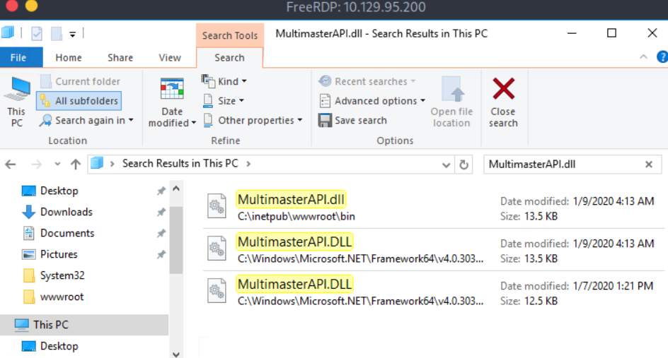
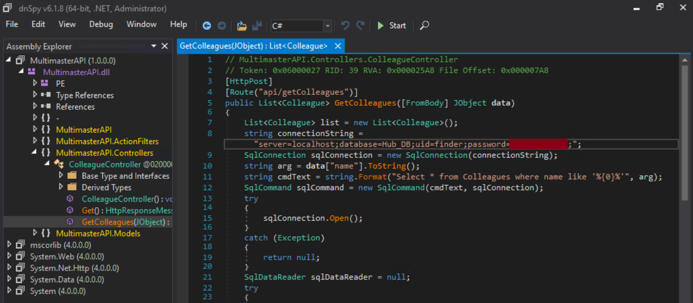

## Attacking Common Applications — Skills Assessment III Write-up


### Objective

The goal of this assessment was to locate a hardcoded password for the MSSQL service inside the `MultimasterAPI.dll` file.


### Reconnaissance

I searched the Windows host for files named `MultimasterAPI.dll` using Explorer:



I chose the first result because its path did not look like a system/framework copy (other copies were under `C:\Windows\Microsoft.NET\...`).

Windows does not include the `strings` utility by default, so I copied the chosen DLL to my Linux analysis host.

To do that I reconnected to the Windows host with RDP with a drive mounted to a local path:

```bash
xfreerdp /v:<target_ip> /u:<username> /p:'<password>' /drive:/home/<host_user>,<folder_name>
```

I then copied `MultimasterAPI.dll` from the target into my mounted drive so it was available on my attack box.

On my analysis host I ran:

```bash
strings MultimasterAPI.dll > file.txt
```

In the `file.txt` output I found **.NET** markers near the end, indicating this was a **.NET assembly**:

```bash
.NETFramework,Version=v4.6.1
FrameworkDisplayName
.NET Framework 4.6.1
```

This confirmed the DLL is a **.NET assembly** and likely decompilable rather than a native binary.

#### Deobfuscate / clean the assembly with de4dot

Because the assembly appeared obfuscated, I installed `de4dot` and used it to clean (deobfuscate) it before decompiling:

```bash
sudo apt install de4dot -y
```
and

```bash
de4dot MultimasterAPI.dll
```

Sample `de4dot` output:

```bash
de4dot v3.1.41592.3405 ...
Detected Unknown Obfuscator (/home/<host_user>/MultimasterAPI.dll)
Cleaning /home/<host_user>/MultimasterAPI.dll
Renaming all obfuscated symbols
Saving /home/<host_user>/MultimasterAPI-cleaned.dll
```

This produced `MultimasterAPI-cleaned.dll` for analysis.

#### Decompile and inspect with dnSpy

I opened `MultimasterAPI-cleaned.dll` using `dnSpy` (`dnSpy` was available on the target host) and inspected the decompiled source.

While browsing the decompiled code I found the hardcoded MSSQL password embedded in the assembly source:




## Results & Conclusion

 - Located a non-system copy of `MultimasterAPI.dll`, copied it to my analysis host, and confirmed it was a **.NET assembly** (.NETFramework,Version=v4.6.1) using `strings`.

 - Deobfuscated the assembly with `de4dot`, then opened the cleaned DLL in `dnSpy` and extracted the hardcoded MSSQL password from the decompiled source.

**Conclusion**: The target contained a `MultimasterAPI.dll` with a hardcoded MSSQL credential. By copying the DLL to my analysis host, running `strings`, cleaning with `de4dot`, and decompiling with `dnSpy`, I successfully retrieved the embedded password.
